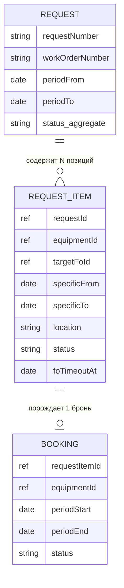
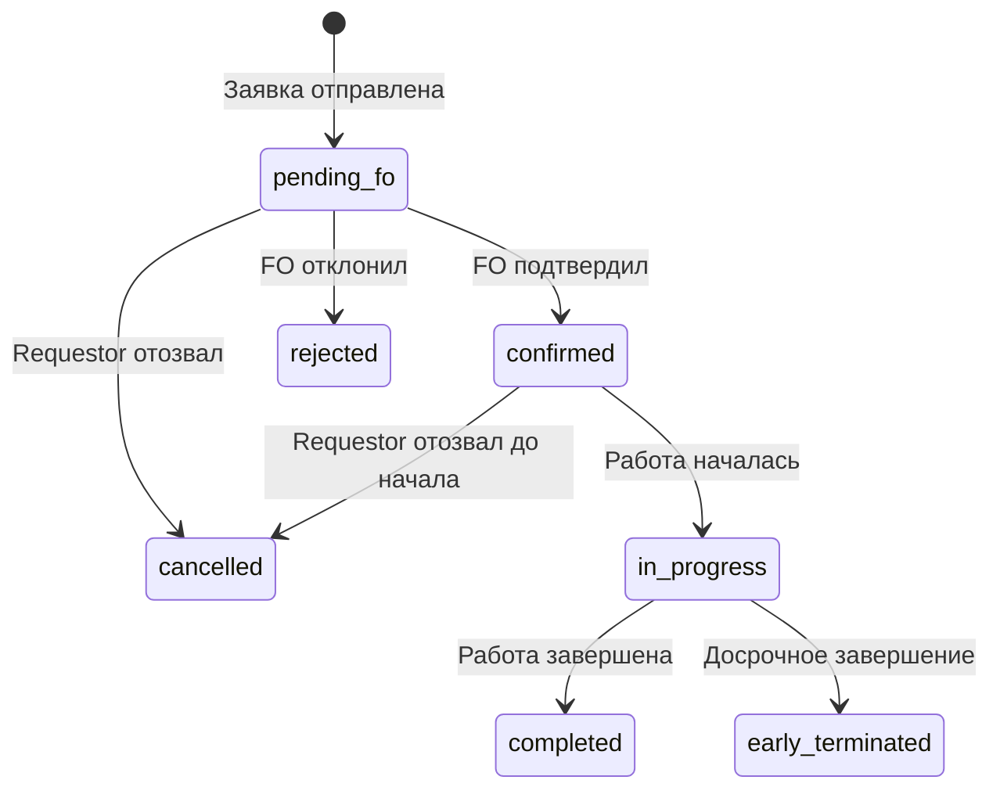
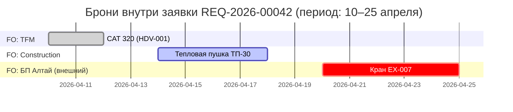
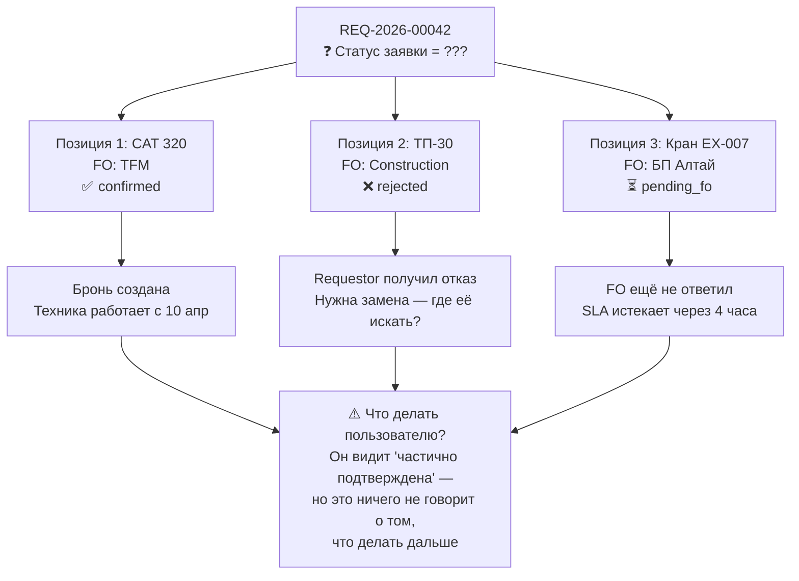
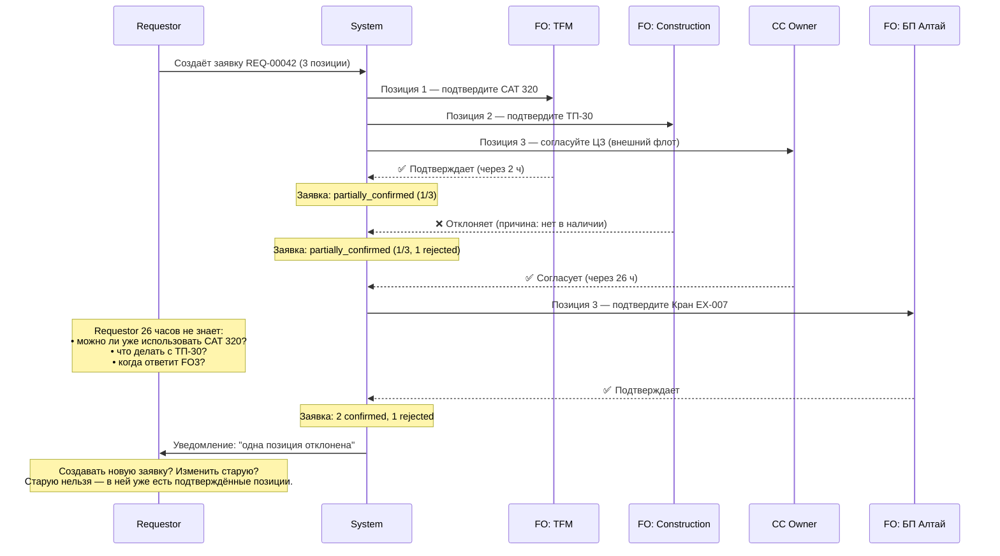

# Жизненный цикл заявки и броней: анализ модели «1 заявка — несколько FO»

**Дата:** 2026-04-09
**Тип документа:** Аналитический — для обсуждения с бизнесом
**Автор:** Claude (BA/SA support)

---

## Контекст

Бизнес хочет: в одной заявке — несколько единиц техники от разных Fleet Owner (FO), с разными датами, временем и локациями.

Это технически реализуемо. Цель данного документа — показать, **какие операционные, UX и интеграционные проблемы** при этом возникают, и предложить альтернативы.

---

## 1. Как устроена модель (основа)

### 1.1 Структура сущностей



**Ключевое:** Request — это контейнер. Реальная жизнь происходит на уровне RequestItem и Booking.

---

### 1.2 Жизненный цикл одной брони



Бронь — атомарная единица: одна техника, один FO, один период, один статус.

---

## 2. Сценарий: что хочет бизнес

Пример заявки REQ-2026-00042 (один WO, три единицы, два FO):

| # | Техника | Fleet Owner | Период | Локация | Статус |
|---|---------|-------------|--------|---------|--------|
| 1 | CAT 320 (HDV-001) | TFM | 10–12 апр | Area A | ? |
| 2 | ТП-30 (HDE-045) | Construction | 14–18 апр | Area B | ? |
| 3 | Кран EX-007 (внешний) | БП «Алтай» | 20–25 апр | Area A | ? |

Временной разброс броней:



На первый взгляд — удобно. Одна заявка, всё вместе. Теперь смотрим на проблемы.

---

## 3. Проблемы

### 3.1 Проблема №1: Статус заявки — неопределён

Каждая позиция проходит согласование независимо. В какой-то момент они будут в разных статусах:



**Нет правильного ответа** на вопрос «какой статус у заявки?» — у неё нет единого состояния. Это не баг реализации, это фундаментальное противоречие: заявка как целое не существует в операционном смысле.

---

### 3.2 Проблема №2: Дедлайны SLA — у каждого FO свои

При отправке заявки каждый FO получает уведомление и должен ответить в течение SLA-окна. Но позиции срочные по-разному:

| Позиция | Дата начала | Когда нужен ответ FO | Дедлайн |
|---------|-------------|----------------------|---------|
| CAT 320 | 10 апр | За 24 ч | **09 апр 10:00** |
| ТП-30 | 14 апр | За 24 ч | **13 апр 10:00** |
| Кран EX-007 | 20 апр | За 48 ч (внешний флот) | **18 апр 10:00** |

→ В рамках одной заявки три разных дедлайна у трёх разных FO.
→ Заявка не может иметь единый SLA — только по каждой позиции отдельно.
→ Напоминания, эскалации, автоотмены — всё это логика на уровне позиции, не заявки.

**Вывод:** заявка как объект бессмысленна для SLA-контроля.

---

### 3.3 Проблема №3: Согласование — запутанный поток



**Пользователь вынужден** принимать решения по отдельным позициям, находясь внутри одной общей заявки — интерфейс для этого не рассчитан.

---

### 3.4 Проблема №4: Отзыв и изменения — «всё или ничего» vs хаос

Когда позиции в разных статусах — возникает вопрос: что означает «отозвать заявку»?

| Сценарий | Ожидание пользователя | Что происходит на деле |
|----------|----------------------|------------------------|
| Отозвать всю заявку | Отменить все позиции | Нельзя — Позиция 1 уже `in_progress` |
| Изменить дату Позиции 2 | Редактировать только одну строку | Позиция уже `rejected` — нужна новая заявка |
| Добавить Позицию 4 | Добавить в ту же заявку | Заявка уже `partially_confirmed` — разрешено ли? |

→ Непонятно, что является операционной единицей: **заявка или позиция**?
→ Пользователю придётся запомнить: «в заявке я управляю позициями», а не заявкой — это неинтуитивно.

---

### 3.5 Проблема №5: Интерфейс пользователя — запутывает

**Список заявок (вид Requestor):**

```
┌──────────────┬──────────────┬────────────────────────┬──────────────┐
│ Номер        │ Период       │ Статус                 │ Единиц (FO)  │
├──────────────┼──────────────┼────────────────────────┼──────────────┤
│ REQ-000042   │ 10–25 апр    │ ⚠️ Частично подтв.      │ 3 ед / 2 FO  │
│ REQ-000041   │ 08–09 апр    │ ✅ Подтверждена          │ 1 ед / 1 FO  │
│ REQ-000040   │ 05–07 апр    │ ✅ Завершена             │ 4 ед / 1 FO  │
└──────────────┴──────────────┴────────────────────────┴──────────────┘
```

**Вопросы, на которые пользователь не найдёт ответа в списке:**
- «10–25 апр» — это период самой ранней и самой поздней брони. Что это значит для заявки?
- «Частично подтверждена» — сколько? Которая? Что делать?
- Можно ли уже работать с подтверждёнными единицами?

---

**Детальный вид заявки REQ-000042:**

```
┌──────────────────────────────────────────────────────────────────────────────────┐
│ REQ-2026-00042                              Статус: ⚠️ ЧАСТИЧНО ПОДТВЕРЖДЕНА      │
│ WO#: 12345678  |  Приоритет: P2  |  Создана: 08.04.2026  |  Requestor: Иванов  │
├──────────────────────────────────────────────────────────────────────────────────┤
│ Позиции заявки                                                                   │
├───┬────────────────────┬──────────────────┬─────────────┬──────────┬────────────┤
│ # │ Техника            │ Fleet Owner       │ Период      │ Локация  │ Статус     │
├───┼────────────────────┼──────────────────┼─────────────┼──────────┼────────────┤
│ 1 │ CAT 320 (HDV-001)  │ TFM              │ 10–12 апр   │ Area A   │ ✅ Подтвержд│
│ 2 │ ТП-30 (HDE-045)    │ Construction     │ 14–18 апр   │ Area B   │ ❌ Отклонена│
│ 3 │ Кран EX-007        │ БП Алтай (внеш.) │ 20–25 апр   │ Area A   │ ⏳ Ожидает  │
└───┴────────────────────┴──────────────────┴─────────────┴──────────┴────────────┘

  [Отозвать заявку]   ← Что это означает? Отозвать всё? Только pending? Только rejected?
```

**Проблема FO:** Fleet Owner TFM видит входящую заявку REQ-000042. В ней три позиции — но его касается только одна. Он видит чужую технику, чужие сроки. Это лишний шум и потенциальная путаница.

---

### 3.6 Проблема №6: Внешний флот — несколько RWA в DCT

Для каждой единицы внешнего флота система создаёт отдельный документ в DCT (RWA / дополнительное соглашение). Если в одной заявке — несколько БП (внешних FO):

```
REQ-000042
  └── Кран EX-007 (БП Алтай)     → RWA #А-2026-001 в DCT
  └── Погрузчик PL-011 (БП NORD) → RWA #А-2026-002 в DCT
```

→ Пользователю (CC Owner) нужно согласовать разные RWA по разным ЦЗ — внутри одной заявки.
→ В DCT нет понятия «заявка» — только отдельные документы. Связь логически рвётся.
→ Нельзя агрегировать затраты по заявке: каждая БП — отдельный договор, отдельная статья расходов.

---

## 4. Альтернативные модели

### Вариант A: 1 заявка = 1 FO (строгий)

```
WO# 12345678
  ├── REQ-000042-A  →  FO: TFM         (CAT 320, 10–12 апр, Area A)
  ├── REQ-000042-B  →  FO: Construction (ТП-30, 14–18 апр, Area B)
  └── REQ-000042-C  →  FO: БП Алтай   (Кран, 20–25 апр, Area A)
```

| Критерий | Оценка |
|----------|--------|
| Статус-машина | ✅ Однозначная |
| SLA | ✅ Один дедлайн на заявку |
| UI | ✅ Простой: 1 заявка = 1 статус |
| Согласование | ✅ Один поток на FO |
| Нагрузка на Requestor | ⚠️ 3 клика вместо 1 при создании |
| Связь с WO | ✅ Через поле workOrderNumber |

---

### Вариант B: 1 заявка = N единиц от 1 FO, группировка по WO в UI *(рекомендуемый)*

Пользователь создаёт заявку — система автоматически разбивает по FO. В интерфейсе — группировка по WO.

```
WO# 12345678                    ← Пользователь видит этот уровень как "свою задачу"
  ├── REQ-000042-A (FO: TFM)    ← Строки разбиты по FO автоматически
  ├── REQ-000042-B (FO: Construction)
  └── REQ-000042-C (FO: БП Алтай)
```

**UI — вид Requestor (сгруппировано по WO):**

```
┌─────────────────────────────────────────────────────────────────────┐
│ ▼ WO# 12345678                                   3 заявки | P2      │
├──────────────┬──────────────┬───────────────────┬───────────────────┤
│ REQ-000042-A │ 10–12 апр    │ ✅ Подтверждена    │ TFM / CAT 320     │
│ REQ-000042-B │ 14–18 апр    │ ❌ Отклонена       │ Constr / ТП-30    │
│ REQ-000042-C │ 20–25 апр    │ ⏳ Ожидает FO      │ БП Алтай / Кран   │
└──────────────┴──────────────┴───────────────────┴───────────────────┘
  [Создать новую заявку в этот WO]
```

Пользователь **видит «свою задачу»** через WO, но **управляет отдельными заявками** — каждая с чётким статусом и действиями.

| Критерий | Оценка |
|----------|--------|
| Статус-машина | ✅ Однозначная на уровне заявки |
| SLA | ✅ Один дедлайн на заявку |
| UI | ✅ Группировка по WO даёт контекст |
| Отзыв | ✅ Отзывать можно поштучно |
| DCT/RWA | ✅ 1 заявка = 1 RWA |
| Нагрузка на Requestor | ✅ Система сама разбивает по FO |

---

### Вариант C: Оставить «как хочет бизнес», но с ограничениями

Если бизнес настаивает — реализуемо через модель Request → RequestItems. Но нужно принять:

1. **Все действия — на уровне позиции**, не заявки (отзыв, продление, изменение).
2. **Статус заявки — информационный**, не операционный: «2 из 3 подтверждено».
3. **«Отозвать заявку»** = отозвать все незащищённые позиции. Подтверждённые/активные — только по отдельности.
4. **FO видит только свои позиции** — фильтрация в уведомлениях и интерфейсе FO.
5. **SLA считается на уровне позиции**, не заявки.
6. **Отдельный RWA в DCT** для каждой внешней позиции — заявка в DCT не отображается.

Это реализуемо, но значительно усложняет систему и требует отдельного UX-дизайна для управления позициями.

---

## 5. Итоговая рекомендация

| | Вариант A | **Вариант B** | Вариант C |
|-|-----------|---------------|-----------|
| Сложность разработки | Низкая | Средняя | Высокая |
| Понятность для пользователя | Средняя | **Высокая** | Низкая |
| Операционная чёткость | Высокая | **Высокая** | Низкая |
| Соответствие запросу бизнеса | Нет | **Частично** | Да |
| Риск ошибок пользователя | Низкий | **Низкий** | Высокий |

**Рекомендация: Вариант B.**

Бизнес хочет, чтобы пользователь мог в одном контексте (WO) работать с несколькими единицами от разных FO. Это достигается **группировкой по WO в интерфейсе**, без слияния несвязанных броней в один объект.

Одна заявка = одна единица (или несколько от одного FO) = один поток согласования = один статус = один SLA = один RWA. Это чисто, предсказуемо, масштабируемо.

---

## 6. Вопросы для обсуждения с бизнесом

| # | Вопрос | Почему важен |
|---|--------|--------------|
| Q1 | Что именно пользователь хочет видеть «вместе» — и зачем? | Понять настоящую потребность за требованием |
| Q2 | Как пользователь сейчас отзывает часть заявки в JDE/Excel? | Возможно, проблемы нет — просто привычка |
| Q3 | Должен ли FO видеть всю заявку или только свои позиции? | Определяет интерфейс FO |
| Q4 | Что означает «статус заявки» для отчётности? | Если отчёты по WO — Вариант B работает лучше |
| Q5 | Хочет ли бизнес отзывать одну позицию, не трогая другие? | Если да — Вариант A/B обязателен |
