```mermaid
erDiagram

    %% ─── Equipment-блок ───────────────────────────────────────────────────────

    EquipmentTypes {
        UUID id PK
        VARCHAR name
        ENUM mobilityType
        BOOLEAN requiresTransport
        INT sortOrder
    }

    Fleets {
        UUID id PK
        VARCHAR name
        ENUM type
        VARCHAR aadGroupId
    }

    FleetManagePermissions {
        UUID id PK
        UUID fleetId FK
        UUID userId FK
        TIMESTAMP createdAt
        TIMESTAMP expiresAt
    }

    Equipments {
        UUID id PK
        UUID equipmentTypeId FK
        UUID fleetId FK
        ENUM ownershipType
        VARCHAR tcoId
        VARCHAR stateNumber
        VARCHAR serialNumber
        TEXT description
        VARCHAR brand
        VARCHAR model
        ENUM shareType
        BOOLEAN isCritical
        INT yearOfManufacture
        VARCHAR serviceZoneCode
        VARCHAR costCenter
        VARCHAR baseLocation
    }

    EquipmentPhotos {
        UUID id PK
        UUID equipmentId FK
        VARCHAR url
        INT sortOrder
        BOOLEAN isPrimary
    }

    EquipmentStatuses {
        UUID id PK
        UUID equipmentId FK
        ENUM status
        TEXT reason
        DATE startsAt
        DATE endsAt
        DATE actualEndsAt
        TIMESTAMP cancelledAt
        ENUM source
    }

    MeasurementUnits {
        UUID id PK
        VARCHAR code
        VARCHAR displayName
        INT sortOrder
    }

    Properties {
        UUID id PK
        VARCHAR name
        ENUM dataType
        UUID unitId FK
    }

    PropertyEnumValues {
        UUID id PK
        UUID propertyId FK
        VARCHAR value
        INT sortOrder
    }

    EquipmentTypeProperties {
        UUID id PK
        UUID equipmentTypeId FK
        UUID propertyId FK
        BOOLEAN isRequired
        BOOLEAN isFilterable
        BOOLEAN isVisibleInCard
        INT sortOrder
    }

    EquipmentProperties {
        UUID id PK
        UUID equipmentId FK
        UUID propertyId FK
        JSONB value
    }

    MaintenancePartners {
        UUID id PK
        VARCHAR name
        TEXT contactInfo
    }

    EquipmentMaintenanceContracts {
        UUID id PK
        UUID equipmentId FK
        UUID partnerId FK
        VARCHAR serviceType
        TEXT notes
    }

    SystemSettings {
        VARCHAR key PK
        VARCHAR value
        TIMESTAMP updatedAt
    }

    Users {
        UUID id PK
        VARCHAR externalId
        VARCHAR email
        VARCHAR displayName
        VARCHAR departmentCode
        ENUM userType
    }

    %% ─── Booking-блок ────────────────────────────────────────────────────────

    BookingRequests {
        UUID id PK
        INT requestNumber
        ENUM type
        ENUM status
        VARCHAR workOrderNumber
        VARCHAR location
        VARCHAR workDescription
        TEXT comments
        ENUM priority
        UUID createdBy
        TIMESTAMP createdAt
    }

    Bookings {
        UUID id PK
        UUID requestId FK
        UUID equipmentId
        UUID fleetId
        ENUM status
        TIMESTAMP startDt
        TIMESTAMP endDt
        TIMESTAMP actualStartDt
        TIMESTAMP actualEndDt
        TEXT justification
        UUID transportBookingId FK
        TEXT declineReason
        TEXT terminateReason
    }

    BookingStatuses {
        UUID id PK
        UUID bookingId FK
        ENUM status
        UUID changedBy
        TIMESTAMP changedAt
        TEXT comment
    }

    EquipmentFeedbacks {
        UUID id PK
        UUID equipmentId FK
        UUID bookingId FK
        TEXT feedback
        UUID createdBy
        TIMESTAMP createdAt
    }

    BookingRequestStatuses {
        UUID id PK
        UUID requestId FK
        ENUM status
        UUID changedBy
        TIMESTAMP changedAt
        TEXT comment
    }

    %% ─── Связи Equipment-блока ───────────────────────────────────────────────

    EquipmentTypes       ||--o{ Equipments              : "equipmentTypeId"
    Fleets               ||--o{ Equipments              : "fleetId"
    Fleets               ||--o{ FleetManagePermissions  : "fleetId"
    Users                ||--o{ FleetManagePermissions  : "userId"

    Equipments           ||--o{ EquipmentPhotos         : "equipmentId"
    Equipments           ||--o{ EquipmentStatuses       : "equipmentId"
    Equipments           ||--o{ EquipmentProperties     : "equipmentId"
    Equipments           ||--o{ EquipmentMaintenanceContracts : "equipmentId"

    EquipmentTypes       ||--o{ EquipmentTypeProperties : "equipmentTypeId"
    Properties           ||--o{ EquipmentTypeProperties : "propertyId"
    Properties           ||--o{ EquipmentProperties    : "propertyId"
    Properties           ||--o{ PropertyEnumValues      : "propertyId"
    MeasurementUnits     ||--o{ Properties             : "unitId"

    MaintenancePartners  ||--o{ EquipmentMaintenanceContracts : "partnerId"

    %% ─── Связи Booking-блока ─────────────────────────────────────────────────

    BookingRequests      ||--o{ Bookings               : "requestId"
    Bookings             ||--o{ BookingStatuses        : "bookingId"
    Bookings             ||--o| Bookings               : "transportBookingId (self-ref)"
    Equipments           ||--o{ EquipmentFeedbacks       : "equipmentId"
    Bookings             ||--o{ EquipmentFeedbacks       : "bookingId"

    BookingRequests      ||--o{ BookingRequestStatuses  : "requestId"
```

# Схема БД v5 — Mermaid ER-диаграмма

**Дата:** 2026-05-04  
**Версия схемы:** v5 (Equipments + Bookings)

> Внешние ссылки без FK-ограничений (equipmentId, fleetId, createdBy, changedBy) показаны пунктирной линией `..`.  
> Отсутствие FK — намеренное архитектурное решение: Users, Equipments, Fleets рассматриваются как внешние сервисы по отношению к Booking-блоку.

---

---

## Легенда статусов

### EquipmentStatuses.status

| Значение | Описание | Активная запись определяется по |
|----------|----------|--------------------------------|
| Frozen | Заморозка FO-ом | `startsAt ≤ today AND (endsAt IS NULL OR endsAt ≥ today) AND cancelledAt IS NULL` |
| InRepair | В ремонте | `actualEndsAt IS NULL` |
| Decommissioned | Списана | `cancelledAt IS NULL` |
| *(Available)* | Доступна — нет активных записей | Вычисляется по отсутствию активных записей |

### Bookings.status / BookingStatuses.status

| Значение | Описание |
|----------|----------|
| Draft | Создана вместе с заявкой |
| Submitted | Заявка отправлена; ожидает FO |
| Confirmed | FO подтвердил; для unwheeled — ожидает транспорт |
| TransportConfirmed | FO привязал транспортную бронь (только unwheeled) |
| Declined | FO отклонил |
| Revoked | Заявитель отозвал до обработки |
| Terminated | Досрочно завершена |
| InProgress | FO нажал «Mobilization started» |
| Closed | Ручное закрытие |
| EquipmentChanged | FO предложил замену техники |
| Extended | Бронь продлена |
