```mermaid
erDiagram

    %% ─── Equipment-блок ───────────────────────────────────────────────────────

    EquipmentTypes {
        UUID id PK
        JSON name
        VARCHAR iconUrl
        ENUM mobilityType
        BOOLEAN requiresTransport
        ENUM equipmentClass
        UUID workCenterId FK
        INT sortOrder
        TIMESTAMP createdAt
        UUID createdBy
        TIMESTAMP updatedAt
        UUID updatedBy
        BOOLEAN isDeleted
        TIMESTAMP deletedAt
        UUID deletedBy
    }

    Fleets {
        UUID id PK
        JSON name
        ENUM type
        UUID userId
        VARCHAR aadGroupId
        TIMESTAMP createdAt
        UUID createdBy
        TIMESTAMP updatedAt
        UUID updatedBy
        BOOLEAN isDeleted
        TIMESTAMP deletedAt
        UUID deletedBy
    }

    WorkCenters {
        UUID id PK
        JSON name
        VARCHAR code
        TIMESTAMP createdAt
        UUID createdBy
        TIMESTAMP updatedAt
        UUID updatedBy
        BOOLEAN isDeleted
        TIMESTAMP deletedAt
        UUID deletedBy
    }

    EquipmentBrands {
        UUID id PK
        JSON name
        INT sortOrder
        TIMESTAMP createdAt
        UUID createdBy
        TIMESTAMP updatedAt
        UUID updatedBy
        BOOLEAN isDeleted
        TIMESTAMP deletedAt
        UUID deletedBy
    }

    EquipmentModels {
        UUID id PK
        UUID brandId FK
        JSON name
        INT sortOrder
        TIMESTAMP createdAt
        UUID createdBy
        TIMESTAMP updatedAt
        UUID updatedBy
        BOOLEAN isDeleted
        TIMESTAMP deletedAt
        UUID deletedBy
    }

    Locations {
        UUID id PK
        VARCHAR code
        JSON name
        INT sortOrder
        TIMESTAMP createdAt
        UUID createdBy
        TIMESTAMP updatedAt
        UUID updatedBy
        BOOLEAN isDeleted
        TIMESTAMP deletedAt
        UUID deletedBy
    }

    CostCenters {
        UUID id PK
        VARCHAR code
        JSON name
        INT sortOrder
        TIMESTAMP createdAt
        UUID createdBy
        TIMESTAMP updatedAt
        UUID updatedBy
        BOOLEAN isDeleted
        TIMESTAMP deletedAt
        UUID deletedBy
    }

    ServiceZones {
        UUID id PK
        VARCHAR code
        JSON name
        INT sortOrder
        TIMESTAMP createdAt
        UUID createdBy
        TIMESTAMP updatedAt
        UUID updatedBy
        BOOLEAN isDeleted
        TIMESTAMP deletedAt
        UUID deletedBy
    }

    Divisions {
        UUID id PK
        VARCHAR code
        JSON name
        INT sortOrder
        TIMESTAMP createdAt
        UUID createdBy
        TIMESTAMP updatedAt
        UUID updatedBy
        BOOLEAN isDeleted
        TIMESTAMP deletedAt
        UUID deletedBy
    }

    Groups {
        UUID id PK
        UUID divisionId FK
        VARCHAR code
        JSON name
        INT sortOrder
        TIMESTAMP createdAt
        UUID createdBy
        TIMESTAMP updatedAt
        UUID updatedBy
        BOOLEAN isDeleted
        TIMESTAMP deletedAt
        UUID deletedBy
    }

    Departments {
        UUID id PK
        UUID groupId FK
        VARCHAR code
        JSON name
        INT sortOrder
        TIMESTAMP createdAt
        UUID createdBy
        TIMESTAMP updatedAt
        UUID updatedBy
        BOOLEAN isDeleted
        TIMESTAMP deletedAt
        UUID deletedBy
    }

    Sections {
        UUID id PK
        UUID departmentId FK
        VARCHAR code
        JSON name
        INT sortOrder
        TIMESTAMP createdAt
        UUID createdBy
        TIMESTAMP updatedAt
        UUID updatedBy
        BOOLEAN isDeleted
        TIMESTAMP deletedAt
        UUID deletedBy
    }

    FleetManagePermissions {
        UUID id PK
        UUID fleetId FK
        UUID userId FK
        TIMESTAMP createdAt
        UUID createdBy
        TIMESTAMP expiresAt
        TIMESTAMP updatedAt
        UUID updatedBy
        BOOLEAN isDeleted
        TIMESTAMP deletedAt
        UUID deletedBy
    }

    Equipments {
        UUID id PK
        UUID equipmentTypeId FK
        UUID fleetId FK
        ENUM ownershipType
        VARCHAR tcoId
        VARCHAR jdeId
        VARCHAR stateNumber
        VARCHAR vin
        VARCHAR serialNumber
        TEXT description
        UUID brandId FK
        UUID modelId FK
        ENUM shareType
        BOOLEAN isCritical
        INT yearOfManufacture
        DECIMAL plannedEngineHoursPerDay
        DECIMAL plannedMileagePerDay
        UUID serviceZoneId FK
        UUID costCenterId FK
        UUID baseLocationId FK
        UUID sectionId FK
        TIMESTAMP createdAt
        UUID createdBy
        TIMESTAMP updatedAt
        UUID updatedBy
        BOOLEAN isDeleted
        TIMESTAMP deletedAt
        UUID deletedBy
    }

    EquipmentPhotos {
        UUID id PK
        UUID equipmentId FK
        VARCHAR url
        INT sortOrder
        BOOLEAN isPrimary
        TIMESTAMP createdAt
        UUID createdBy
        TIMESTAMP updatedAt
        UUID updatedBy
        BOOLEAN isDeleted
        TIMESTAMP deletedAt
        UUID deletedBy
    }

    EquipmentStatuses {
        UUID id PK
        UUID equipmentId FK
        ENUM status
        TEXT reason
        DATE startsAt
        DATE endsAt
        DATE actualEndsAt
        TIMESTAMP cancelledAt
        ENUM source
        TIMESTAMP createdAt
        UUID createdBy
        TIMESTAMP updatedAt
        UUID updatedBy
        BOOLEAN isDeleted
        TIMESTAMP deletedAt
        UUID deletedBy
    }

    MeasurementUnits {
        UUID id PK
        VARCHAR code
        VARCHAR displayName
        INT sortOrder
        TIMESTAMP createdAt
        UUID createdBy
        TIMESTAMP updatedAt
        UUID updatedBy
        BOOLEAN isDeleted
        TIMESTAMP deletedAt
        UUID deletedBy
    }

    Properties {
        UUID id PK
        JSON name
        ENUM dataType
        UUID unitId FK
        TIMESTAMP createdAt
        UUID createdBy
        TIMESTAMP updatedAt
        UUID updatedBy
        BOOLEAN isDeleted
        TIMESTAMP deletedAt
        UUID deletedBy
    }

    PropertyEnumValues {
        UUID id PK
        UUID propertyId FK
        VARCHAR value
        INT sortOrder
        TIMESTAMP createdAt
        UUID createdBy
        TIMESTAMP updatedAt
        UUID updatedBy
        BOOLEAN isDeleted
        TIMESTAMP deletedAt
        UUID deletedBy
    }

    EquipmentTypeProperties {
        UUID id PK
        UUID equipmentTypeId FK
        UUID propertyId FK
        BOOLEAN isRequired
        BOOLEAN isFilterable
        BOOLEAN isVisibleInCard
        INT sortOrder
        TIMESTAMP createdAt
        UUID createdBy
        TIMESTAMP updatedAt
        UUID updatedBy
        BOOLEAN isDeleted
        TIMESTAMP deletedAt
        UUID deletedBy
    }

    EquipmentProperties {
        UUID id PK
        UUID equipmentId FK
        UUID propertyId FK
        JSONB value
        TIMESTAMP createdAt
        UUID createdBy
        TIMESTAMP updatedAt
        UUID updatedBy
        BOOLEAN isDeleted
        TIMESTAMP deletedAt
        UUID deletedBy
    }

    MaintenancePartners {
        UUID id PK
        JSON name
        VARCHAR phoneNumber
        VARCHAR email
        VARCHAR address
        TIMESTAMP createdAt
        UUID createdBy
        TIMESTAMP updatedAt
        UUID updatedBy
        BOOLEAN isDeleted
        TIMESTAMP deletedAt
        UUID deletedBy
    }

    EquipmentMaintenanceContracts {
        UUID id PK
        UUID equipmentId FK
        UUID partnerId FK
        VARCHAR serviceType
        TEXT notes
        TIMESTAMP createdAt
        UUID createdBy
        TIMESTAMP updatedAt
        UUID updatedBy
        BOOLEAN isDeleted
        TIMESTAMP deletedAt
        UUID deletedBy
    }

    SystemSettings {
        VARCHAR key PK
        VARCHAR value
        TIMESTAMP createdAt
        UUID createdBy
        TIMESTAMP updatedAt
        UUID updatedBy
        BOOLEAN isDeleted
        TIMESTAMP deletedAt
        UUID deletedBy
    }

    Users {
        UUID id PK
        VARCHAR badgeNumber
        VARCHAR fullName
        VARCHAR email
        VARCHAR sharedEmail
        VARCHAR jobTitle
        UUID departmentId FK
        BOOLEAN isActive
        UUID businessPartnerId FK
        ENUM type
        TIMESTAMP createdAt
        UUID createdBy
        TIMESTAMP updatedAt
        UUID updatedBy
        BOOLEAN isDeleted
        TIMESTAMP deletedAt
        UUID deletedBy
    }

    BusinessPartners {
        UUID id PK
        JSON name
        TEXT description
        VARCHAR bin
        VARCHAR country
        VARCHAR city
        VARCHAR address
        VARCHAR email
        VARCHAR phoneNumber
        VARCHAR externalId
        BOOLEAN isActive
        TIMESTAMP createdAt
        UUID createdBy
        TIMESTAMP updatedAt
        UUID updatedBy
        BOOLEAN isDeleted
        TIMESTAMP deletedAt
        UUID deletedBy
    }

    %% ─── Booking-блок ────────────────────────────────────────────────────────

    BookingRequests {
        UUID id PK
        INT requestNumber
        ENUM type
        ENUM status
        VARCHAR workOrderJdeId
        VARCHAR location
        VARCHAR workDescription
        TEXT comments
        ENUM priority
        UUID createdBy
        TIMESTAMP createdAt
        TIMESTAMP updatedAt
        UUID updatedBy
        BOOLEAN isDeleted
        TIMESTAMP deletedAt
        UUID deletedBy
    }

    Bookings {
        UUID id PK
        UUID requestId FK
        UUID equipmentId
        UUID fleetId
        ENUM status
        TIMESTAMP startDt
        TIMESTAMP endDt
        TIMESTAMP actualStartDt
        TIMESTAMP actualEndDt
        TEXT justification
        BOOLEAN requiresSupervisorApproval
        ENUM supervisorApprovalStatus
        UUID supervisorApprovedBy
        TIMESTAMP supervisorApprovedAt
        TEXT supervisorComment
        UUID transportBookingId FK
        TEXT declineReason
        TEXT terminateReason
        TIMESTAMP createdAt
        UUID createdBy
        TIMESTAMP updatedAt
        UUID updatedBy
        BOOLEAN isDeleted
        TIMESTAMP deletedAt
        UUID deletedBy
    }

    BookingStatuses {
        UUID id PK
        UUID bookingId FK
        ENUM status
        UUID changedBy
        TIMESTAMP changedAt
        TEXT comment
        TIMESTAMP createdAt
        UUID createdBy
        TIMESTAMP updatedAt
        UUID updatedBy
        BOOLEAN isDeleted
        TIMESTAMP deletedAt
        UUID deletedBy
    }

    EquipmentFeedbacks {
        UUID id PK
        UUID equipmentId FK
        UUID bookingId FK
        TEXT feedback
        UUID createdBy
        TIMESTAMP createdAt
        TIMESTAMP updatedAt
        UUID updatedBy
        BOOLEAN isDeleted
        TIMESTAMP deletedAt
        UUID deletedBy
    }

    BookingRequestStatuses {
        UUID id PK
        UUID requestId FK
        ENUM status
        UUID changedBy
        TIMESTAMP changedAt
        TEXT comment
        TIMESTAMP createdAt
        UUID createdBy
        TIMESTAMP updatedAt
        UUID updatedBy
        BOOLEAN isDeleted
        TIMESTAMP deletedAt
        UUID deletedBy
    }

    %% ─── Связи Equipment-блока ───────────────────────────────────────────────

    WorkCenters          ||--o{ EquipmentTypes          : "workCenterId"
    EquipmentTypes       ||--o{ Equipments              : "equipmentTypeId"
    Fleets               ||--o{ Equipments              : "fleetId"
    Fleets               ||--o{ FleetManagePermissions  : "fleetId"
    Users                ||--o{ FleetManagePermissions  : "userId"

    EquipmentBrands      ||--o{ EquipmentModels         : "brandId"
    EquipmentBrands      ||--o{ Equipments              : "brandId"
    EquipmentModels      ||--o{ Equipments              : "modelId"
    Locations            ||--o{ Equipments              : "baseLocationId"
    CostCenters          ||--o{ Equipments              : "costCenterId"
    ServiceZones         ||--o{ Equipments              : "serviceZoneId"
    Divisions            ||--o{ Groups                  : "divisionId"
    Groups               ||--o{ Departments             : "groupId"
    Departments          ||--o{ Sections                : "departmentId"
    Sections             ||--o{ Equipments              : "sectionId"
    Departments          ||--o{ Users                   : "departmentId"

    Equipments           ||--o{ EquipmentPhotos         : "equipmentId"
    Equipments           ||--o{ EquipmentStatuses       : "equipmentId"
    Equipments           ||--o{ EquipmentProperties     : "equipmentId"
    Equipments           ||--o{ EquipmentMaintenanceContracts : "equipmentId"

    EquipmentTypes       ||--o{ EquipmentTypeProperties : "equipmentTypeId"
    Properties           ||--o{ EquipmentTypeProperties : "propertyId"
    Properties           ||--o{ EquipmentProperties    : "propertyId"
    Properties           ||--o{ PropertyEnumValues      : "propertyId"
    MeasurementUnits     ||--o{ Properties             : "unitId"

    MaintenancePartners  ||--o{ EquipmentMaintenanceContracts : "partnerId"

    %% ─── Связи Booking-блока ─────────────────────────────────────────────────

    BookingRequests      ||--o{ Bookings               : "requestId"
    Bookings             ||--o{ BookingStatuses        : "bookingId"
    Bookings             ||--o| Bookings               : "transportBookingId (self-ref)"
    Equipments           ||--o{ EquipmentFeedbacks       : "equipmentId"
    Bookings             ||--o{ EquipmentFeedbacks       : "bookingId"

    BookingRequests      ||--o{ BookingRequestStatuses  : "requestId"
    BusinessPartners     ||--o{ Users                  : "businessPartnerId"
```

# Схема БД v10 — Mermaid ER-диаграмма

**Created:** 2026-05-14  
**Last updated:** 2026-05-14  
**Version:** v10 (Equipments + Bookings + supervisor approval update)

> Внешние ссылки без FK-ограничений (equipmentId, fleetId, createdBy, changedBy и др.) показаны пунктирной линией `..`.  
> Все таблицы содержат стандартный набор аудит-полей: `createdAt`, `createdBy`, `updatedAt`, `updatedBy`, `isDeleted`, `deletedAt`, `deletedBy`.

---

---

## Легенда статусов

### EquipmentStatuses.status

| Значение | Описание | Активная запись определяется по |
|---|---|---|
| Frozen | Заморозка FO-ом | `startsAt ≤ today AND (endsAt IS NULL OR endsAt ≥ today) AND cancelledAt IS NULL` |
| InRepair | В ремонте | `actualEndsAt IS NULL` |
| Decommissioned | Списана | `cancelledAt IS NULL` |
| *(Available)* | Доступна — нет активных записей | Вычисляется по отсутствию активных записей |

### Bookings.status / BookingStatuses.status

| Значение | Описание |
|---|---|
| Draft | Создана вместе с заявкой |
| Submitted | Заявка отправлена; ожидает FO |
| ConfirmedByFo | FO подтвердил `LongTermRented`; ожидается решение `FleetOwners' Supervisor` |
| Confirmed | FO подтвердил; для unwheeled — ожидает транспорт |
| TransportConfirmed | FO привязал транспортную бронь (только unwheeled) |
| Declined | FO отклонил |
| Revoked | Заявитель отозвал до обработки |
| Terminated | Досрочно завершена |
| InProgress | FO нажал «Mobilization started» |
| Closed | Ручное закрытие |
| EquipmentChanged | FO предложил замену техники |
| Extended | Бронь продлена |

---

## Аудит-поля — напоминание

Каждая из 31 таблицы содержит стандартный набор:

| Поле | Тип | Nullable |
|---|---|---|
| createdAt | TIMESTAMP | NOT NULL |
| createdBy | UUID | NOT NULL (nullable только в SystemSettings) |
| updatedAt | TIMESTAMP | nullable |
| updatedBy | UUID | nullable |
| isDeleted | BOOLEAN | NOT NULL DEFAULT false |
| deletedAt | TIMESTAMP | nullable |
| deletedBy | UUID | nullable |
