# Схема БД v11 — Azure SQL Mermaid ER-диаграмма

**Created:** 2026-05-14  
**Last updated:** 2026-05-14  
**Version:** v11 (Azure SQL adaptation)

> Типы данных адаптированы под Azure SQL: `uniqueidentifier`, `datetime2(3)`, `bit`, `nvarchar(max)`.  
> `enum` заменены на `ref_*` таблицы.  
> `name JSON` заменён на `nameEn`, `nameRu`, `nameKz`.
> Для всех основных mutable таблиц в v11 предполагаются **system-versioned temporal tables**, кроме `BookingStatuses`, `BookingRequestStatuses`, `EquipmentStatuses`, которые остаются явными history/event tables.

---

```mermaid
erDiagram

    ref_fleet_type {
        uniqueidentifier id PK
        nvarchar code
        nvarchar nameEn
        nvarchar nameRu
    }

    ref_equipment_mobility_type {
        uniqueidentifier id PK
        nvarchar code
        nvarchar nameEn
        nvarchar nameRu
    }

    ref_equipment_class {
        uniqueidentifier id PK
        nvarchar code
        nvarchar nameEn
        nvarchar nameRu
    }

    ref_ownership_type {
        uniqueidentifier id PK
        nvarchar code
        nvarchar nameEn
        nvarchar nameRu
    }

    ref_share_type {
        uniqueidentifier id PK
        nvarchar code
        nvarchar nameEn
        nvarchar nameRu
    }

    ref_equipment_status_type {
        uniqueidentifier id PK
        nvarchar code
        nvarchar nameEn
        nvarchar nameRu
        nvarchar iconUrl
    }

    ref_equipment_current_status {
        uniqueidentifier id PK
        nvarchar code
        nvarchar nameEn
        nvarchar nameRu
    }

    ref_property_data_type {
        uniqueidentifier id PK
        nvarchar code
        nvarchar nameEn
        nvarchar nameRu
    }

    ref_user_type {
        uniqueidentifier id PK
        nvarchar code
        nvarchar nameEn
        nvarchar nameRu
    }

    ref_request_type {
        uniqueidentifier id PK
        nvarchar code
        nvarchar nameEn
        nvarchar nameRu
    }

    ref_request_priority {
        uniqueidentifier id PK
        nvarchar code
        nvarchar nameEn
        nvarchar nameRu
    }

    ref_booking_request_status {
        uniqueidentifier id PK
        nvarchar code
        nvarchar nameEn
        nvarchar nameRu
    }

    ref_booking_status {
        uniqueidentifier id PK
        nvarchar code
        nvarchar nameEn
        nvarchar nameRu
    }

    EquipmentTypes {
        uniqueidentifier id PK
        nvarchar nameEn
        nvarchar nameRu
        nvarchar nameKz
        nvarchar iconUrl
        uniqueidentifier mobilityTypeId FK
        bit requiresTransport
        uniqueidentifier equipmentClassId FK
        uniqueidentifier workCenterId FK
        int sortOrder
        datetime2 createdAt
        uniqueidentifier createdBy
        datetime2 updatedAt
        uniqueidentifier updatedBy
        bit isDeleted
        datetime2 deletedAt
        uniqueidentifier deletedBy
    }

    Fleets {
        uniqueidentifier id PK
        nvarchar nameEn
        nvarchar nameRu
        nvarchar nameKz
        uniqueidentifier fleetTypeId FK
        uniqueidentifier userId
        nvarchar aadGroupId
        datetime2 createdAt
        uniqueidentifier createdBy
        datetime2 updatedAt
        uniqueidentifier updatedBy
        bit isDeleted
        datetime2 deletedAt
        uniqueidentifier deletedBy
    }

    WorkCenters {
        uniqueidentifier id PK
        nvarchar code
        nvarchar nameEn
        nvarchar nameRu
        nvarchar nameKz
        datetime2 createdAt
        uniqueidentifier createdBy
        datetime2 updatedAt
        uniqueidentifier updatedBy
        bit isDeleted
        datetime2 deletedAt
        uniqueidentifier deletedBy
    }

    Equipments {
        uniqueidentifier id PK
        uniqueidentifier equipmentTypeId FK
        uniqueidentifier fleetId FK
        uniqueidentifier ownershipTypeId FK
        uniqueidentifier currentStatusId FK
        nvarchar tcoId
        nvarchar jdeId
        nvarchar stateNumber
        nvarchar vin
        nvarchar serialNumber
        nvarchar description
        uniqueidentifier brandId FK
        uniqueidentifier modelId FK
        uniqueidentifier shareTypeId FK
        bit isCritical
        int yearOfManufacture
        decimal plannedMotohourPerDay
        decimal plannedMileagePerDay
        uniqueidentifier serviceZoneId FK
        uniqueidentifier costCenterId FK
        uniqueidentifier baseLocationId FK
        uniqueidentifier sectionId FK
        datetime2 createdAt
        uniqueidentifier createdBy
        datetime2 updatedAt
        uniqueidentifier updatedBy
        bit isDeleted
        datetime2 deletedAt
        uniqueidentifier deletedBy
    }

    EquipmentStatuses {
        uniqueidentifier id PK
        uniqueidentifier equipmentId FK
        uniqueidentifier statusTypeId FK
        nvarchar reason
        date startsAt
        date endsAt
        date actualEndsAt
        datetime2 cancelledAt
        uniqueidentifier sourceId FK
        datetime2 createdAt
        uniqueidentifier createdBy
        datetime2 updatedAt
        uniqueidentifier updatedBy
        bit isDeleted
        datetime2 deletedAt
        uniqueidentifier deletedBy
    }

    Properties {
        uniqueidentifier id PK
        nvarchar nameEn
        nvarchar nameRu
        nvarchar nameKz
        uniqueidentifier dataTypeId FK
        uniqueidentifier unitId FK
        datetime2 createdAt
        uniqueidentifier createdBy
        datetime2 updatedAt
        uniqueidentifier updatedBy
        bit isDeleted
        datetime2 deletedAt
        uniqueidentifier deletedBy
    }

    PropertyEnumValues {
        uniqueidentifier id PK
        uniqueidentifier propertyId FK
        nvarchar value
        int sortOrder
    }

    EquipmentTypeProperties {
        uniqueidentifier id PK
        uniqueidentifier equipmentTypeId FK
        uniqueidentifier propertyId FK
        bit isRequired
        bit isFilterable
        bit isVisibleInCard
        int sortOrder
    }

    EquipmentProperties {
        uniqueidentifier id PK
        uniqueidentifier equipmentId FK
        uniqueidentifier propertyId FK
        nvarchar valueString
        bigint valueInt
        decimal valueDecimal
        bit valueBit
        uniqueidentifier propertyEnumValueId FK
    }

    Users {
        uniqueidentifier id PK
        nvarchar fullName
        nvarchar email
        uniqueidentifier userTypeId FK
        bit isActive
    }

    JdeWorkOrders {
        uniqueidentifier id PK
        nvarchar jdeWorkOrderId
        nvarchar workOrderName
        nvarchar workOrderStatus
        nvarchar workOrderStatusDescription
        uniqueidentifier priorityId FK
        nvarchar sourcePayload
        datetime2 lastSyncedAt
        bit isActive
    }

    JdeWorkOrderSteps {
        uniqueidentifier id PK
        uniqueidentifier jdeWorkOrderRefId FK
        uniqueidentifier workCenterId FK
        nvarchar stepName
        int stepVolume
        datetime2 plannedStartDateTime
        datetime2 plannedEndDateTime
        nvarchar sourcePayload
        datetime2 lastSyncedAt
        bit isActive
    }

    BookingRequests {
        uniqueidentifier id PK
        int requestNumber
        uniqueidentifier requestTypeId FK
        uniqueidentifier jdeWorkOrderRefId FK
        uniqueidentifier statusId FK
        nvarchar workOrderNumber
        nvarchar location
        nvarchar workDescription
        nvarchar comments
        uniqueidentifier priorityId FK
        uniqueidentifier createdBy
        datetime2 createdAt
        datetime2 updatedAt
        uniqueidentifier updatedBy
        bit isDeleted
        datetime2 deletedAt
        uniqueidentifier deletedBy
    }

    Bookings {
        uniqueidentifier id PK
        uniqueidentifier requestId FK
        uniqueidentifier equipmentId
        uniqueidentifier fleetId
        uniqueidentifier workCenterId FK
        uniqueidentifier jdeWorkOrderStepRefId FK
        uniqueidentifier statusId FK
        datetime2 plannedStartDateTime
        datetime2 plannedEndDateTime
        datetime2 actualStartDateTime
        datetime2 actualEndDateTime
        nvarchar justification
        bit requiresSupervisorApproval
        uniqueidentifier supervisorApprovedBy
        datetime2 supervisorApprovedAt
        nvarchar supervisorComment
        uniqueidentifier transportBookingId FK
        nvarchar declineReason
        nvarchar terminateReason
        datetime2 createdAt
        uniqueidentifier createdBy
        datetime2 updatedAt
        uniqueidentifier updatedBy
        bit isDeleted
        datetime2 deletedAt
        uniqueidentifier deletedBy
    }

    BookingStatuses {
        uniqueidentifier id PK
        uniqueidentifier bookingId FK
        uniqueidentifier statusId FK
        uniqueidentifier changedBy
        datetime2 changedAt
        nvarchar comment
    }

    BookingRequestStatuses {
        uniqueidentifier id PK
        uniqueidentifier requestId FK
        uniqueidentifier statusId FK
        uniqueidentifier changedBy
        datetime2 changedAt
        nvarchar comment
    }

    EquipmentTypes ||--o{ Equipments : "equipmentTypeId"
    Fleets ||--o{ Equipments : "fleetId"
    WorkCenters ||--o{ EquipmentTypes : "workCenterId"
    WorkCenters ||--o{ JdeWorkOrderSteps : "workCenterId"
    WorkCenters ||--o{ Bookings : "workCenterId"

    ref_equipment_mobility_type ||--o{ EquipmentTypes : "mobilityTypeId"
    ref_equipment_class ||--o{ EquipmentTypes : "equipmentClassId"
    ref_fleet_type ||--o{ Fleets : "fleetTypeId"
    ref_ownership_type ||--o{ Equipments : "ownershipTypeId"
    ref_share_type ||--o{ Equipments : "shareTypeId"
    ref_equipment_current_status ||--o{ Equipments : "currentStatusId"
    ref_equipment_status_type ||--o{ EquipmentStatuses : "statusTypeId"
    ref_property_data_type ||--o{ Properties : "dataTypeId"
    ref_user_type ||--o{ Users : "userTypeId"
    ref_request_type ||--o{ BookingRequests : "requestTypeId"
    ref_request_priority ||--o{ BookingRequests : "priorityId"
    ref_request_priority ||--o{ JdeWorkOrders : "priorityId"
    ref_booking_request_status ||--o{ BookingRequests : "statusId"
    ref_booking_request_status ||--o{ BookingRequestStatuses : "statusId"
    ref_booking_status ||--o{ Bookings : "statusId"
    ref_booking_status ||--o{ BookingStatuses : "statusId"

    Equipments ||--o{ EquipmentStatuses : "equipmentId"
    Equipments ||--o{ EquipmentProperties : "equipmentId"
    Properties ||--o{ EquipmentProperties : "propertyId"
    Properties ||--o{ PropertyEnumValues : "propertyId"
    EquipmentTypes ||--o{ EquipmentTypeProperties : "equipmentTypeId"
    Properties ||--o{ EquipmentTypeProperties : "propertyId"
    PropertyEnumValues ||--o{ EquipmentProperties : "propertyEnumValueId"

    JdeWorkOrders ||--o{ JdeWorkOrderSteps : "jdeWorkOrderRefId"
    JdeWorkOrders ||--o{ BookingRequests : "jdeWorkOrderRefId"
    BookingRequests ||--o{ Bookings : "requestId"
    JdeWorkOrderSteps ||--o{ Bookings : "jdeWorkOrderStepRefId"
    Bookings ||--o{ BookingStatuses : "bookingId"
    BookingRequests ||--o{ BookingRequestStatuses : "requestId"
    Bookings ||--o| Bookings : "transportBookingId"
```

