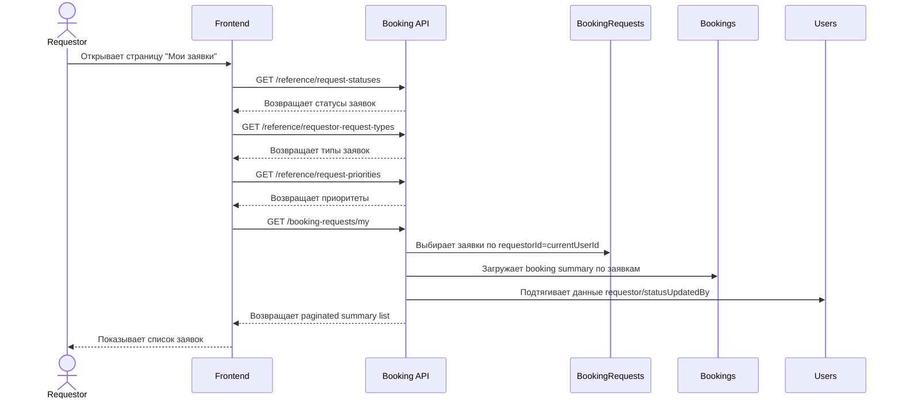

# UC-REQ-01 - Просмотр моих заявок

**Created:** 2026-05-15  
**Last updated:** 2026-06-08  
**Автор документов:** Telman Nurzhanov (SA)

---

## Карточка use case

| Поле | Значение |
|---|---|
| Область действия | Страница `Мои заявки` |
| Участник | Пользователь с ролью [`Requestor`](../../Roles and Access Model.md) |
| Покрываемые FR (BRD) | `FR-024`, `FR-025`, `FR-026`, `FR-091`; Additional: `BRD-U-001` |
| Покрываемые FR (Equipment block list) | — |
| Предусловие | Пользователь авторизован в системе; пользователь находится на странице `Мои заявки`; пользователь имеет роль [`Requestor`](../../Roles and Access Model.md) |
| Триггер | Вход на страницу `Мои заявки` |
| Ожидаемый результат | Отображается список [незавершенных заявок](../../../glossary/Glossary.md) текущего пользователя с краткой информацией по броням |
| Используемые API | [`GET /booking-requests/my`](../../../api/booking/requestor/GET_booking_requests_my.md), [`GET /booking-requests/{id}`](../../../api/booking/requestor/GET_booking_requests_id.md), [`GET /reference/request-statuses`](../../../api/booking/reference/GET_reference_request_statuses.md), [`GET /reference/requestor-request-types`](../../../api/booking/reference/GET_reference_requestor_request_types.md), [`GET /reference/request-priorities`](../../../api/booking/reference/GET_reference_request_priorities.md) |

---

## Основной сценарий

1. Пользователь открывает страницу `Мои заявки`.
2. Frontend загружает справочники фильтров через [`GET /reference/request-statuses`](../../../api/booking/reference/GET_reference_request_statuses.md), [`GET /reference/requestor-request-types`](../../../api/booking/reference/GET_reference_requestor_request_types.md), [`GET /reference/request-priorities`](../../../api/booking/reference/GET_reference_request_priorities.md); для `priority` справочник также содержит `description` и `color`.
3. Frontend вызывает [`GET /booking-requests/my`](../../../api/booking/requestor/GET_booking_requests_my.md).
4. Backend возвращает только [незавершенные заявки](../../../glossary/Glossary.md) текущего пользователя.
5. Frontend отображает список заявок в таблице.
6. Для каждой заявки отображаются:
   - номер заявки;
   - дата создания;
   - данные реквестора;
   - номер Work Order;
   - приоритет с цветом, соответствующим настройке справочника;
   - краткий список броней.
7. Для каждой брони в summary-блоке отображаются:
   - тип техники;
   - марка / модель;
   - номер ТШО;
   - ГРНЗ;
   - work center;
   - владелец;
   - плановый диапазон брони;
   - фактический диапазон брони;
   - статус.
8. При выборе конкретной заявки frontend может открыть детальный просмотр через [`GET /booking-requests/{id}`](../../../api/booking/requestor/GET_booking_requests_id.md).

---

## UML Sequence Diagram

---

## Альтернативные сценарии

1. У пользователя нет [незавершенных заявок](../../../glossary/Glossary.md).
   Система отображает пустое состояние и кнопку `Создать заявку`.

2. Пользователь применяет фильтры.
   Frontend повторно вызывает [`GET /booking-requests/my`](../../../api/booking/requestor/GET_booking_requests_my.md) с query-параметрами фильтрации.

3. Backend возвращает ошибку авторизации или доступа.
   Frontend отображает сообщение об ошибке и не показывает данные таблицы.

4. Пользователь открывает карточку конкретной заявки.
   Frontend вызывает [`GET /booking-requests/{id}`](../../../api/booking/requestor/GET_booking_requests_id.md) и отображает detail view.

---

## Замечания

1. Use case опирается на правило: страница `Мои заявки` показывает только [незавершенные заявки](../../../glossary/Glossary.md), то есть active / non-terminal requests.
2. История завершенных заявок должна быть вынесена в отдельный flow / отдельный endpoint.
3. [`GET /booking-requests/my`](../../../api/booking/requestor/GET_booking_requests_my.md) должен возвращать summary-данные, а не полные booking details.
