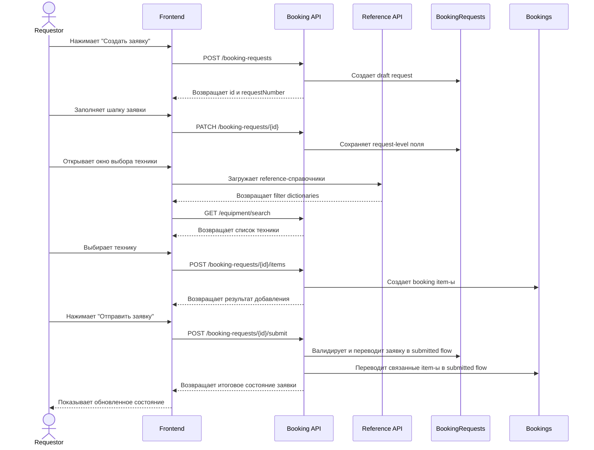

# UC-REQ-02 - Создание новой заявки (Draft-first)

**Created:** 2026-05-15  
**Last updated:** 2026-06-08  
**Автор документов:** Telman Nurzhanov (SA)

---

## Карточка use case

| Поле | Значение |
|---|---|
| Область действия | Экран `Новая заявка` |
| Участник | Пользователь с ролью `Requestor` |
| Покрываемые FR (BRD) | `FR-023`, `FR-024`, `FR-026`, `FR-027`, `FR-030`, `FR-031`, `FR-032`, `FR-033`, `FR-038`, `FR-039`, `FR-040`, `FR-041`, `FR-062`, `FR-072`, `FR-NEW-04`, `FR-NEW-08`, `FR-NEW-10`, `FR-NEW-11`, `FR-NEW-12`, `FR-NEW-13`, `FR-NEW-14`, `FR-NEW-15`, `FR-NEW-16`, `FR-NEW-17`, `FR-NEW-38`, `FR-NEW-39`, `FR-NEW-50`, `FR-NEW-51`, `FR-NEW-68`, `FR-NEW-69`, `FR-NEW-70`, `FR-NEW-71` |
| Покрываемые FR (Additional list) | — |
| Предусловие | Пользователь авторизован; пользователь находится на странице, где доступно создание заявки; пользователь имеет роль `Requestor` |
| Триггер | Нажатие кнопки `Создать заявку` |
| Ожидаемый результат | Создана новая draft-заявка, пользователь может добавить технику, сохранить черновик или отправить заявку |
| Используемые API | [`POST /booking-requests`](../../../../api/booking/requestor/POST_booking_requests.md), [`PATCH /booking-requests/{id}`](../../../../api/booking/requestor/PATCH_booking_requests_id.md), [`GET /equipment/search`](../../../../api/booking/requestor/GET_equipment_search.md), [`POST /booking-requests/{id}/items`](../../../../api/booking/requestor/POST_booking_requests_id_items.md), [`DELETE /booking-requests/{id}/items/{bookingId}`](../../../../api/booking/requestor/DELETE_booking_requests_id_items_bookingId.md), [`POST /booking-requests/{id}/submit`](../../../../api/booking/requestor/POST_booking_requests_id_submit.md), [`GET /reference/equipment-types`](../../../../api/booking/reference/GET_reference_equipment_types.md), [`GET /reference/fleets`](../../../../api/booking/reference/GET_reference_fleets.md), [`GET /reference/work-centers`](../../../../api/booking/reference/GET_reference_work_centers.md), [`GET /reference/ownership-types`](../../../../api/booking/reference/GET_reference_ownership_types.md), [`GET /reference/share-types`](../../../../api/booking/reference/GET_reference_share_types.md), [`GET /reference/equipment-types/{equipmentTypeId}/properties`](../../../../api/booking/reference/GET_reference_equipment_types_id_properties.md) |

---

## Декомпозиция

Данный use case является родительским и декомпозируется на следующие под-use cases:

1. `UC-REQ-02.1 - Создание пустого draft заявки`
2. `UC-REQ-02.2 - Заполнение и редактирование шапки заявки`
3. `UC-REQ-02.3 - Поиск техники для добавления в заявку`
4. `UC-REQ-02.4 - Добавление техники в draft-заявку`
5. `UC-REQ-02.5 - Редактирование брони или замена техники в draft`
6. `UC-REQ-02.6 - Отправка draft-заявки`
7. `UC-REQ-02.7 - Отмена draft-брони`

---

## Основной сценарий

1. Пользователь нажимает кнопку `Создать заявку`.
2. Frontend вызывает [`POST /booking-requests`](../../../../api/booking/requestor/POST_booking_requests.md).
3. Backend создаёт пустую draft-заявку и возвращает `id` и `requestNumber`.
4. Frontend открывает окно `Новая заявка` и показывает номер, сгенерированный системой.
5. Пользователь заполняет request-level поля:
   - `default work order`;
   - номер Work Order;
   - приоритет;
   - локация;
   - описание работ;
   - комментарий.
6. Если пользователь включает `default work order`, frontend:
   - блокирует ручной ввод номера Work Order;
   - передаёт на backend `isDefaultWorkOrder = true`;
   - передаёт `workOrderNumber = null`.
7. Frontend сохраняет изменения request-level полей через debounced autosave ([`PATCH /booking-requests/{id}`](../../../../api/booking/requestor/PATCH_booking_requests_id.md)) после изменения значений пользователем.
8. Пользователь нажимает кнопку `Добавить технику`.
9. Frontend открывает окно выбора техники.
10. При первом открытии окна frontend подтягивает базовые справочники фильтров:
   - справочник типов техники ([`GET /api/booking/v1/reference/equipment-types`](../../../../api/booking/reference/GET_reference_equipment_types.md));
   - справочник fleet-ов ([`GET /api/booking/v1/reference/fleets`](../../../../api/booking/reference/GET_reference_fleets.md));
   - справочник work centers ([`GET /api/booking/v1/reference/work-centers`](../../../../api/booking/reference/GET_reference_work_centers.md));
   - справочник / reference values для `ownershipType` ([`GET /api/booking/v1/reference/ownership-types`](../../../../api/booking/reference/GET_reference_ownership_types.md));
   - справочник / reference values для `shareType` ([`GET /api/booking/v1/reference/share-types`](../../../../api/booking/reference/GET_reference_share_types.md)).
11. После выбора `equipmentType` frontend дополнительно подтягивает dynamic filters (properties), доступные для выбранного типа техники ([`GET /api/booking/v1/reference/equipment-types/{equipmentTypeId}/properties`](../../../../api/booking/reference/GET_reference_equipment_types_id_properties.md)).
12. При первом открытии окна таблица техники пустая; случайный или произвольный список по умолчанию не показывается.
13. Frontend вызывает [`GET /equipment/search`](../../../../api/booking/requestor/GET_equipment_search.md) после задания параметров поиска и передаёт фильтры:
   - тип техники;
   - дата начала брони;
   - дата окончания брони;
   - fleet;
   - work center;
   - госномер или ТШО ID;
   - `shareType` / `ownershipType`;
   - dynamic properties.
14. Пользователь выбирает одну или несколько единиц техники.
15. Frontend создаёт booking item-ы через [`POST /booking-requests/{id}/items`](../../../../api/booking/requestor/POST_booking_requests_id_items.md).
16. Если для конкретной единицы техники требуется `justification`, система помечает такой item как незавершённый до заполнения обязательного поля позже, на основной странице заявки.
17. Пользователь продолжает редактирование draft-заявки до тех пор, пока не сформирует нужный состав item-ов и не заполнит необходимые `justification`.
18. Пользователь выбирает одно из действий:
    - оставить заявку в статусе draft;
    - отправить заявку.
19. При отправке frontend вызывает [`POST /booking-requests/{id}/submit`](../../../../api/booking/requestor/POST_booking_requests_id_submit.md).
20. Backend валидирует заявку, проверяет обязательные request-level поля, item-level justification и переводит заявку в submitted flow.
21. Сценарий поддерживает только on-demand создание заявки; weekly schedule management в рамках данного flow отсутствует.

---

## UML Sequence Diagram

---

## Альтернативные сценарии

1. Пользователь закрыл окно после создания draft.
   Draft-заявка остаётся в системе и доступна для дальнейшего редактирования.

2. Пользователь не нашёл подходящую технику.
   Окно выбора техники показывает пустой результат поиска.

3. Для выбранной техники обязателен `justification`, но пользователь его не заполнил после добавления item в заявку.
   Item остаётся незавершённым, а система не позволяет отправить заявку до исправления ошибки.

4. Пользователь отменяет ранее добавленный booking item.
   Frontend вызывает [`DELETE /booking-requests/{id}/items/{bookingId}`](../../../../api/booking/requestor/DELETE_booking_requests_id_items_bookingId.md).

5. Пользователь использует `Default Work Order`.
   Поле номера Work Order блокируется, а backend получает `isDefaultWorkOrder = true` и `workOrderNumber = null`.

6. Пользователь сохраняет заявку как draft и возвращается к ней позже.
   Дальнейшая работа выполняется через [`GET /booking-requests/{id}`](../../../../api/booking/requestor/GET_booking_requests_id.md) и [`PATCH /booking-requests/{id}`](../../../../api/booking/requestor/PATCH_booking_requests_id.md).

7. Пользователь меняет фильтры в окне выбора техники.
   Frontend повторно вызывает [`GET /equipment/search`](../../../../api/booking/requestor/GET_equipment_search.md) при каждом изменении фильтра или поисковой строки.

8. Справочники фильтров не удалось загрузить.
   Frontend показывает ошибку в окне выбора техники и не позволяет выполнить поиск до успешной загрузки обязательных reference-данных.

---

## Замечания

1. Сценарий зафиксирован как `Draft-first`: номер заявки генерируется при создании draft, а не отдельным reserve-number API.
2. Выбор нескольких единиц техники поддерживается на этапе добавления item-ов в draft.
3. Request-level и booking-level данные должны храниться раздельно:
   - request-level: header заявки;
   - booking-level: отдельные item-ы.
4. Полный detail flow заявки должен опираться на [`GET /booking-requests/{id}`](../../../../api/booking/requestor/GET_booking_requests_id.md).
5. [`POST /booking-requests`](../../../../api/booking/requestor/POST_booking_requests.md) создаёт именно пустой draft и не должен требовать обязательного заполнения business-полей на момент открытия формы.
6. Обязательные поля проверяются на этапе [`POST /booking-requests/{id}/submit`](../../../../api/booking/requestor/POST_booking_requests_id_submit.md), а не на этапе создания draft.
7. Для окна выбора техники нужны отдельные read-only reference APIs для загрузки справочников фильтров:
   - [`GET /api/booking/v1/reference/equipment-types`](../../../../api/booking/reference/GET_reference_equipment_types.md)
   - [`GET /api/booking/v1/reference/fleets`](../../../../api/booking/reference/GET_reference_fleets.md)
   - [`GET /api/booking/v1/reference/work-centers`](../../../../api/booking/reference/GET_reference_work_centers.md)
   - [`GET /api/booking/v1/reference/ownership-types`](../../../../api/booking/reference/GET_reference_ownership_types.md)
   - [`GET /api/booking/v1/reference/share-types`](../../../../api/booking/reference/GET_reference_share_types.md)
   - [`GET /api/booking/v1/reference/equipment-types/{equipmentTypeId}/properties`](../../../../api/booking/reference/GET_reference_equipment_types_id_properties.md)
8. Если этих API ещё нет, они должны быть выделены отдельной задачей в API scope.
