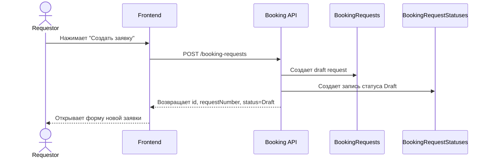

# UC-REQ-02.1 - Создание пустого draft заявки

**Created:** 2026-05-15  
**Last updated:** 2026-06-03  
**Автор документов:** Telman Nurzhanov (SA)

---

## Карточка use case

| Поле | Значение |
|---|---|
| Область действия | Кнопка `Создать заявку` |
| Участник | [`Requestor`](../../../Roles and Access Model.md) |
| Покрываемые FR (BRD) | `FR-023`, `FR-024`, `FR-027`, `FR-030`, `FR-072` |
| Покрываемые FR (Equipment block list) | — |
| Триггер | Нажатие кнопки `Создать заявку` |
| Ожидаемый результат | Создан пустой `Draft`, пользователю возвращены `id` и `requestNumber` |
| Используемые API | [`POST /booking-requests`](../../../../api/booking/requestor/POST_booking_requests.md) |

---

## Основной сценарий

1. Пользователь нажимает `Создать заявку`.
2. Frontend вызывает [`POST /booking-requests`](../../../../api/booking/requestor/POST_booking_requests.md) с минимальным payload для draft.
3. Backend создаёт пустую draft-заявку.
4. Backend возвращает `id`, `requestNumber`, `status = Draft`.
5. Frontend открывает форму редактирования новой заявки.

---

## UML Sequence Diagram

---

## Альтернативные сценарии

1. Пользователь не авторизован.
   Backend возвращает ошибку доступа.

2. Создание draft не удалось.
   Frontend показывает ошибку и не открывает форму.
