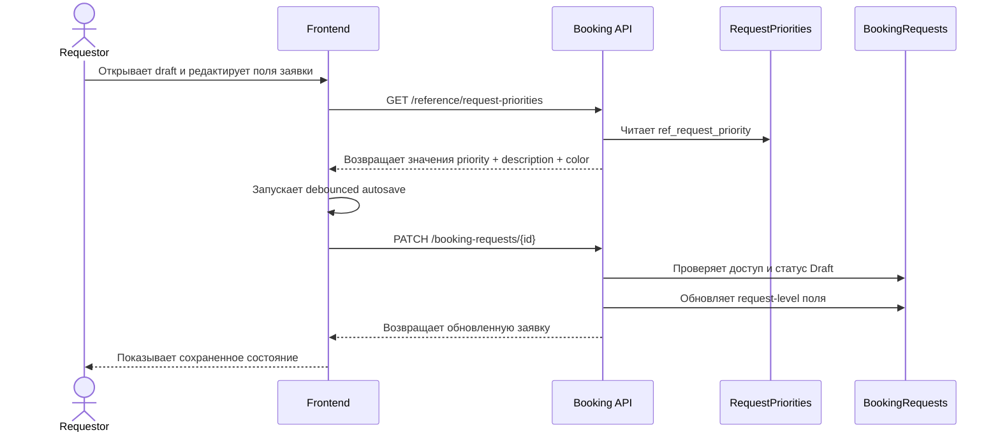

# UC-REQ-02.2 - Заполнение и редактирование шапки заявки

**Created:** 2026-05-15  
**Last updated:** 2026-06-08  
**Автор документов:** Telman Nurzhanov (SA)

---

## Карточка use case

| Поле | Значение |
|---|---|
| Область действия | Экран `Новая заявка` |
| Участник | [`Requestor`](../../../Roles and Access Model.md) |
| Покрываемые FR (BRD) | `FR-027`, `FR-NEW-11`, `FR-NEW-12`, `FR-NEW-13`, `FR-NEW-14`, `FR-NEW-51`, `FR-NEW-69` |
| Покрываемые FR (Equipment block list) | — |
| Триггер | Пользователь редактирует request-level поля draft-заявки |
| Ожидаемый результат | Шапка draft-заявки заполнена и сохранена через autosave |
| Используемые API | [`GET /reference/request-priorities`](../../../../api/booking/reference/GET_reference_request_priorities.md), [`PATCH /booking-requests/{id}`](../../../../api/booking/requestor/PATCH_booking_requests_id.md) |

---

## Основной сценарий

1. При открытии экрана frontend загружает [`GET /reference/request-priorities`](../../../../api/booking/reference/GET_reference_request_priorities.md), чтобы получить доступные priority values, их `description` для tooltip / hint и `color` для UI-отображения.
2. Пользователь редактирует request-level поля: `workOrderNumber`, `priority`, `location`, `workDescription`, `comments`.
3. Пользователь заполняет поля заявки вручную в базовом сценарии без обращения к внешним системам.
4. При выборе `priority` frontend показывает tooltip / hint из справочника и отображает выбранный приоритет в соответствующем цвете.
5. Если пользователь включает `Default Work Order`, frontend передаёт `isDefaultWorkOrder = true`, а `workOrderNumber = null`.
6. Frontend сохраняет изменения через debounced autosave: [`PATCH /booking-requests/{id}`](../../../../api/booking/requestor/PATCH_booking_requests_id.md).
7. Backend обновляет header draft-заявки.

---

## UML Sequence Diagram

---

## Альтернативные сценарии

1. Пользователь не завершил заполнение.
   Draft остаётся частично заполненным.

2. Пользователь включает или выключает `Default Work Order`.
   Frontend сохраняет обновлённые `isDefaultWorkOrder` и `workOrderNumber` через [`PATCH /booking-requests/{id}`](../../../../api/booking/requestor/PATCH_booking_requests_id.md).
