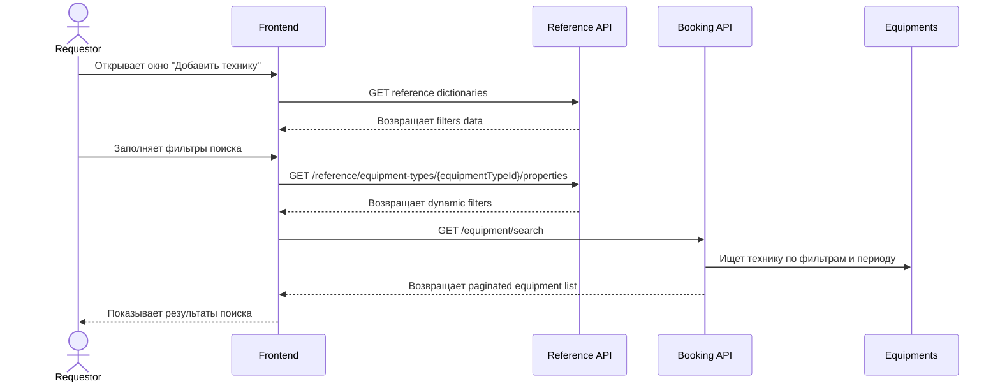

# UC-REQ-02.3 - Поиск техники для добавления в заявку

**Created:** 2026-05-15  
**Last updated:** 2026-06-03  
**Автор документов:** Telman Nurzhanov (SA)

---

## Карточка use case

| Поле | Значение |
|---|---|
| Область действия | Окно `Добавить технику` |
| Участник | `Requestor` |
| Покрываемые FR (BRD) | `FR-031`, `FR-040`, `FR-NEW-38`, `FR-NEW-39`, `FR-NEW-50`, `FR-NEW-68` |
| Покрываемые FR (Additional list) | — |
| Триггер | Открытие окна `Добавить технику` |
| Ожидаемый результат | Пользователь видит доступные фильтры и может выполнить поиск техники |
| Используемые API | [`GET /equipment/search`](../../../../api/booking/requestor/GET_equipment_search.md), [`GET /api/booking/v1/reference/equipment-types`](../../../../api/booking/reference/GET_reference_equipment_types.md), [`GET /api/booking/v1/reference/fleets`](../../../../api/booking/reference/GET_reference_fleets.md), [`GET /api/booking/v1/reference/work-centers`](../../../../api/booking/reference/GET_reference_work_centers.md), [`GET /api/booking/v1/reference/ownership-types`](../../../../api/booking/reference/GET_reference_ownership_types.md), [`GET /api/booking/v1/reference/share-types`](../../../../api/booking/reference/GET_reference_share_types.md), [`GET /api/booking/v1/reference/equipment-types/{equipmentTypeId}/properties`](../../../../api/booking/reference/GET_reference_equipment_types_id_properties.md) |

---

## Основной сценарий

1. Пользователь открывает окно `Добавить технику`.
2. Frontend загружает базовые справочники фильтров:
   - [`GET /api/booking/v1/reference/equipment-types`](../../../../api/booking/reference/GET_reference_equipment_types.md);
   - [`GET /api/booking/v1/reference/fleets`](../../../../api/booking/reference/GET_reference_fleets.md);
   - [`GET /api/booking/v1/reference/work-centers`](../../../../api/booking/reference/GET_reference_work_centers.md);
   - [`GET /api/booking/v1/reference/ownership-types`](../../../../api/booking/reference/GET_reference_ownership_types.md);
   - [`GET /api/booking/v1/reference/share-types`](../../../../api/booking/reference/GET_reference_share_types.md).
3. При первом открытии таблица техники остаётся пустой.
4. Пользователь задаёт фильтры поиска.
5. После выбора `equipmentType` frontend дополнительно загружает dynamic filters для выбранного типа через [`GET /api/booking/v1/reference/equipment-types/{equipmentTypeId}/properties`](../../../../api/booking/reference/GET_reference_equipment_types_id_properties.md).
6. Frontend вызывает [`GET /equipment/search`](../../../../api/booking/requestor/GET_equipment_search.md).
7. Backend возвращает список техники, доступной по фильтрам и периоду.
8. Списанная техника с текущим статусом `Decommissioned` исключается из выдачи и не отображается пользователю.
9. Frontend отображает результаты поиска.

---

## UML Sequence Diagram

---

## Альтернативные сценарии

1. Справочники не загрузились.
   Поиск блокируется до успешной загрузки reference-данных.

2. Подходящая техника не найдена.
   Пользователь видит пустой результат поиска.
