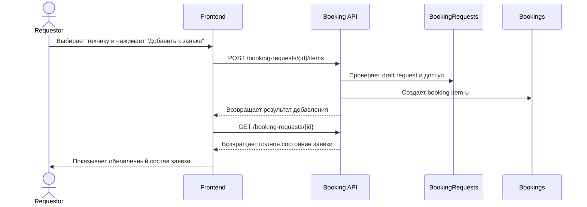

# UC-REQ-02.4 - Добавление техники в draft-заявку

**Created:** 2026-05-15  
**Last updated:** 2026-06-03  
**Автор документов:** Telman Nurzhanov (SA)

---

## Карточка use case

| Поле | Значение |
|---|---|
| Область действия | Окно `Добавить технику` |
| Участник | `Requestor` |
| Покрываемые FR (BRD) | `FR-031`, `FR-033`, `FR-038`, `FR-039`, `FR-NEW-04`, `FR-NEW-08`, `FR-NEW-15`, `FR-NEW-71` |
| Покрываемые FR (Additional list) | — |
| Триггер | Пользователь выбрал одну или несколько единиц техники и нажал `Добавить к заявке` |
| Ожидаемый результат | В draft-заявку добавлены booking item-ы |
| Используемые API | [`POST /booking-requests/{id}/items`](../../../../api/booking/requestor/POST_booking_requests_id_items.md) |

---

## Основной сценарий

1. Пользователь выбирает одну или несколько единиц техники в результатах поиска и нажимает `Добавить к заявке`.
2. Frontend вызывает [`POST /booking-requests/{id}/items`](../../../../api/booking/requestor/POST_booking_requests_id_items.md) и передаёт список выбранных единиц техники в `items[]`.
3. Backend проверяет, что ни одна из выбранных единиц техники не является стационарной. Если `mobilityType = Stationary`, такая техника не может быть добавлена в draft-заявку.
4. Backend создаёт отдельный booking item для каждой выбранной единицы техники внутри draft-заявки.
5. На этапе [`POST /booking-requests/{id}/items`](../../../../api/booking/requestor/POST_booking_requests_id_items.md) поле `justification` не передаётся.
6. Если для конкретного item требуется `justification`, этот item помечается как незавершённый до его заполнения позже, на основной странице заявки.
7. Backend возвращает список booking item-ов, созданных в текущем добавлении.
8. После выполнения [`POST /booking-requests/{id}/items`](../../../../api/booking/requestor/POST_booking_requests_id_items.md) frontend должен вызвать [`GET /booking-requests/{id}`](../../../../api/booking/requestor/GET_booking_requests_id.md), чтобы получить полное актуальное состояние заявки.
9. После этого frontend отображает пользователю страницу `Новая заявка / Редактировать заявку` с номером заявки.
10. В sidebar страницы сохраняются и отображаются request-level поля:
   - номер Work Order;
   - приоритет;
   - локация;
   - описание работ;
   - комментарий.
11. В центральной части страницы frontend отображает обновлённое состояние заявки с уже добавленными бронями.
12. В центральной части должен отображаться:
   - общее количество добавленной техники / броней по всей заявке, а не только по последнему вызову API;
   - список всех броней, уже входящих в заявку.
13. Для каждой брони в списке должны отображаться поля:
   - фото техники;
   - тип техники;
   - марка, модель;
   - номер ТШО;
   - ГРНЗ;
   - данные Fleet Owner;
   - плановые даты начала и завершения брони;
   - характеристики техники в виде `ключ - значение`;
   - поле `justification`, которое пользователь заполняет непосредственно в карточке / строке этой брони.
14. Таким образом, после добавления техники пользователь видит не отдельный результат последнего запроса, а обновлённое состояние страницы `Новая заявка` с полным составом брони по заявке.

---

## UML Sequence Diagram

---

## Альтернативные сценарии

1. У выбранной техники есть конфликты с другими активными бронями на тот же период.
   Backend все равно создает booking item-ы в draft-заявке. [Booking conflict context](../../../../glossary/Glossary.md#booking-conflict-context) не блокирует добавление и должен быть рассчитан и отображен пользователю как информационный признак для дальнейшего решения Fleet Owner.

2. Добавление item не прошло из-за hard-ограничения доступности техники.
   Backend возвращает ошибку валидации, если техника недоступна по [hard availability restrictions](../../../../glossary/Glossary.md#hard-availability-restriction), не связанным с competing bookings, например из-за `EquipmentStates`, `OnDemand`, `Stationary` или отсутствия требуемой authorization для `Assigned`.

3. Пользователь попытался добавить стационарную технику.
   Если `mobilityType = Stationary`, backend отклоняет добавление и возвращает ошибку валидации.

4. Добавлены несколько item-ов.
   Каждый item создаётся как самостоятельная запись, но все они передаются одним batch-запросом.

5. После добавления техники пользователь возвращается к редактированию заявки.
   Frontend сначала вызывает [`GET /booking-requests/{id}`](../../../../api/booking/requestor/GET_booking_requests_id.md), затем показывает обновлённую страницу `Новая заявка / Редактировать заявку`, где отображается полный список всех броней заявки и общее количество добавленной техники.
