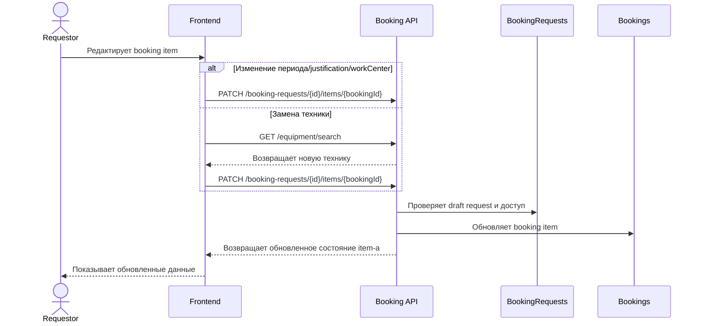

# UC-REQ-02.5 - Редактирование брони или замена техники в draft

**Created:** 2026-05-15  
**Last updated:** 2026-06-02  
**Автор документов:** Telman Nurzhanov (SA)

---

## Карточка use case

| Поле | Значение |
|---|---|
| Область действия | Карточка booking item в draft-заявке |
| Участник | `Requestor`, `ServiceWorkProcessor` |
| Покрываемые FR (BRD) | `FR-027`, `FR-031`, `FR-038`, `FR-040`, `FR-NEW-04`, `FR-NEW-08`, `FR-NEW-71` |
| Покрываемые FR (Additional list) | — |
| Триггер | Пользователь редактирует период брони, justification или хочет заменить технику |
| Ожидаемый результат | Booking item обновлён без удаления всей draft-заявки |
| Используемые API | [`PATCH /booking-requests/{id}/items/{bookingId}`](../../../../api/booking/requestor/PATCH_booking_requests_id_items_bookingId.md), [`GET /equipment/search`](../../../../api/booking/requestor/GET_equipment_search.md) |

---

## Основной сценарий

1. Пользователь открывает booking item на редактирование.
2. Если требуется изменить только период брони, `justification` или `workCenterId`, frontend вызывает [`PATCH /booking-requests/{id}/items/{bookingId}`](../../../../api/booking/requestor/PATCH_booking_requests_id_items_bookingId.md).
3. Если пользователь редактирует inline-поле `justification`, frontend сохраняет его автоматически через [`PATCH /booking-requests/{id}/items/{bookingId}`](../../../../api/booking/requestor/PATCH_booking_requests_id_items_bookingId.md) без отдельной кнопки `Сохранить`.
4. Если требуется заменить технику, frontend повторно открывает окно выбора техники.
5. Frontend повторно вызывает [`GET /equipment/search`](../../../../api/booking/requestor/GET_equipment_search.md) с актуальным периодом и фильтрами.
6. Пользователь выбирает новую технику.
7. Frontend вызывает [`PATCH /booking-requests/{id}/items/{bookingId}`](../../../../api/booking/requestor/PATCH_booking_requests_id_items_bookingId.md) и передаёт обновлённые `equipmentId`, `plannedStartDateTime`, `plannedEndDateTime`, `justification`, `workCenterId`.
8. Backend обновляет существующий booking item и пересчитывает, требуется ли для него `justification`.

---

## UML Sequence Diagram

---

## Альтернативные сценарии

1. При замене техники новая единица имеет конфликты с другими активными бронями на выбранный период.
   Backend сохраняет обновление item. Наличие конфликтов не блокирует редактирование, а должно быть отражено в UI как информационный признак для последующего решения Fleet Owner.

2. Пользователь меняет период брони.
   Backend повторно валидирует итоговые значения item. Пересечения с другими активными бронями не блокируют сохранение, но должны быть рассчитаны как active booking conflicts. Hard-ограничения доступности техники по-прежнему блокируют обновление.

3. Для updated item требуется `justification`, но оно не заполнено.
   Item остаётся незавершённым до исправления.

4. Пользователь ввёл `justification`, но сразу не отправил заявку.
   Значение сохраняется автоматически через [`PATCH /booking-requests/{id}/items/{bookingId}`](../../../../api/booking/requestor/PATCH_booking_requests_id_items_bookingId.md) и остаётся в draft.
