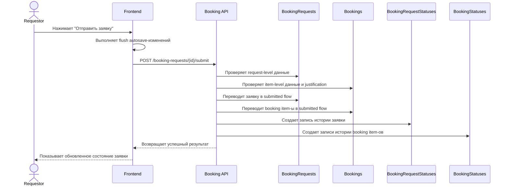

# UC-REQ-02.6 - Отправка draft-заявки

**Created:** 2026-05-15  
**Last updated:** 2026-06-03  
**Автор документов:** Telman Nurzhanov (SA)

---

## Карточка use case

| Поле | Значение |
|---|---|
| Область действия | Экран `Новая заявка` |
| Участник | [`Requestor`](../../../Roles%20and%20Access%20Model.md) |
| Покрываемые FR (BRD) | `FR-023`, `FR-026`, `FR-027`, `FR-062`, `FR-NEW-08`, `FR-NEW-16`, `FR-NEW-17`, `FR-NEW-71` |
| Покрываемые FR (Additional list) | — |
| Триггер | Нажатие кнопки `Отправить заявку` |
| Ожидаемый результат | Draft-заявка валидирована и переведена в submitted flow |
| Используемые API | [`POST /booking-requests/{id}/submit`](../../../../api/booking/requestor/POST_booking_requests_id_submit.md) |

---

## Основной сценарий

1. Пользователь нажимает `Отправить заявку`.
2. Frontend выполняет flush всех несохранённых autosave-изменений booking item-ов, включая `justification`.
3. После успешного flush frontend вызывает [`POST /booking-requests/{id}/submit`](../../../../api/booking/requestor/POST_booking_requests_id_submit.md).
4. Backend выполняет полную бизнес-валидацию request-level и booking-level данных.
5. Backend проверяет, что все обязательные `justification` заполнены в уже сохраненных booking item-ах.
6. Backend переводит заявку и связанные item-ы из `Draft` в submitted flow.
7. Frontend получает успешный результат и обновляет UI.

---

## UML Sequence Diagram

---

## Альтернативные сценарии

1. Не заполнены обязательные поля заявки.
   Backend возвращает ошибку валидации.

2. Есть незавершённые booking item-ы.
   Submit блокируется до исправления item-level данных.

3. Не удалось сохранить одно из autosave-изменений перед submit.
   Frontend не вызывает [`POST /booking-requests/{id}/submit`](../../../../api/booking/requestor/POST_booking_requests_id_submit.md) до успешного завершения flush.

4. На момент submit у одной или нескольких броней есть конфликты с другими активными бронями.
   Backend не блокирует submit только из-за таких конфликтов. Заявка может быть отправлена в submitted flow, а решение по competing bookings принимается [`Fleet Owner`](../../../Roles%20and%20Access%20Model.md) на этапе approval.

5. На момент submit выявлено hard-ограничение доступности техники.
   Backend возвращает ошибку валидации, если техника недоступна по причинам, не связанным с competing bookings, и пользователь должен скорректировать draft.
