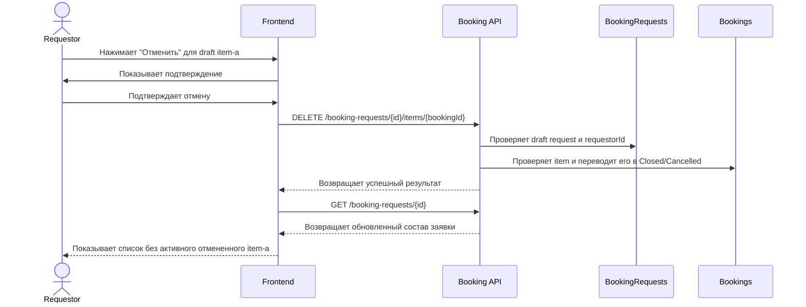

# UC-REQ-02.7 - Отмена draft-брони

**Created:** 2026-05-20  
**Last updated:** 2026-06-03  
**Автор документов:** Telman Nurzhanov (SA)

---

## Карточка use case

| Поле | Значение |
|---|---|
| Область действия | Карточка booking item в draft-заявке |
| Участник | [`Requestor`](../../../Roles and Access Model.md) |
| Покрываемые FR (BRD) | `FR-027`, `FR-031`, `FR-038` |
| Покрываемые FR (Additional list) | — |
| Предусловие | Пользователь авторизован; открыта собственная draft-заявка; в заявке есть booking item в статусе `Draft` |
| Триггер | Нажатие кнопки `Отменить` в карточке draft booking item |
| Ожидаемый результат | Booking item переведен в `Closed` с причиной `Cancelled` и больше не участвует в активном составе draft-заявки |
| Используемые API | [`DELETE /booking-requests/{id}/items/{bookingId}`](../../../../api/booking/requestor/DELETE_booking_requests_id_items_bookingId.md), [`GET /booking-requests/{id}`](../../../../api/booking/requestor/GET_booking_requests_id.md) |

---

## Основной сценарий

1. Пользователь открывает draft-заявку.
2. Frontend отображает список booking item-ов в составе заявки.
3. Пользователь выбирает draft booking item, который больше не нужен.
4. Пользователь нажимает `Отменить`.
5. Frontend может показать подтверждающий диалог перед отменой item-а из draft.
6. После подтверждения frontend вызывает [`DELETE /booking-requests/{id}/items/{bookingId}`](../../../../api/booking/requestor/DELETE_booking_requests_id_items_bookingId.md).
7. Backend проверяет, что:
    - `BookingRequests.requestorId` совпадает с текущим пользователем;
    - заявка находится в статусе `Draft`;
    - booking item принадлежит этой заявке;
    - booking item находится в статусе `Draft`.
8. Backend переводит booking item в terminal state `Closed` с `bookingClosureReason = Cancelled`.
9. Backend сохраняет запись в истории статусов booking item-а.
10. Frontend обновляет состав заявки через [`GET /booking-requests/{id}`](../../../../api/booking/requestor/GET_booking_requests_id.md) или локальное обновление state.
11. Отмененный item больше не отображается в активном составе draft-заявки.

---

## UML Sequence Diagram

---

## Альтернативные сценарии

1. Пользователь передумал отменять draft-бронь.
    Пользователь закрывает подтверждающий диалог, вызов API не выполняется.

2. Заявка или booking item уже не в `Draft`.
   Backend возвращает `REQUEST_NOT_EDITABLE`, frontend показывает сообщение об ошибке и не меняет UI.

3. Booking item не найден или не принадлежит заявке.
   Backend возвращает `NOT_FOUND`.

4. Пользователь отменил последний booking item из draft-заявки.
    Draft-заявка остается существовать как пустой draft и может быть позже дополнена новой техникой или полностью отменена request-level сценарием.

---

## Замечания

1. Сценарий относится только к draft booking item и не применяется после submit заявки.
2. Несмотря на использование `DELETE` endpoint, бизнес-смысл операции трактуется как отмена draft-брони с фиксацией terminal state `Closed` и причины `Cancelled`, а не как физическое удаление без истории.
3. Если пользователь хочет отменить всю draft-заявку целиком, используется отдельный сценарий `UC-REQ-03`.
4. Отмененные draft booking item-ы не должны возвращаться в активный состав draft-заявки, но должны оставаться доступны для audit/history.
