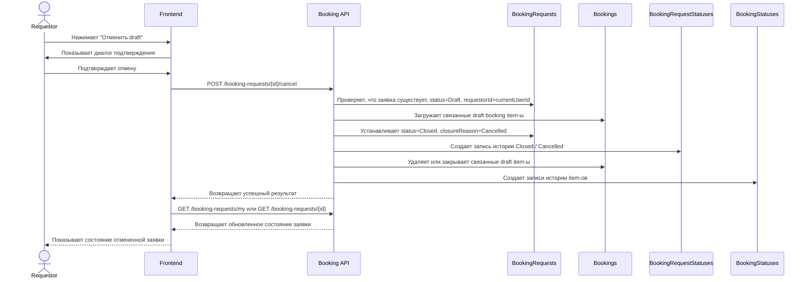

# UC-REQ-03 - Отмена draft-заявки requestor-ом

**Created:** 2026-05-20  
**Last updated:** 2026-06-03  
**Автор документов:** Telman Nurzhanov (SA)

---

## Карточка use case

| Поле | Значение |
|---|---|
| Область действия | Страница `Мои заявки` / detail view draft-заявки |
| Участник | Пользователь с ролью [`Requestor`](../../Roles%20and%20Access%20Model.md) |
| Покрываемые FR (BRD) | `FR-025`, `FR-027` |
| Покрываемые FR (Additional list) | — |
| Предусловие | Пользователь авторизован; пользователь открыл собственную заявку; заявка находится в статусе `Draft` |
| Триггер | Нажатие кнопки `Отменить draft` |
| Ожидаемый результат | Draft-заявка отменена, дальнейшее редактирование и отправка недоступны |
| Используемые API | [`POST /booking-requests/{id}/cancel`](../../../api/booking/requestor/POST_booking_requests_id_cancel.md), [`GET /booking-requests/my`](../../../api/booking/requestor/GET_booking_requests_my.md), [`GET /booking-requests/{id}`](../../../api/booking/requestor/GET_booking_requests_id.md) |

---

## Основной сценарий

1. Пользователь открывает страницу `Мои заявки` или detail view конкретной draft-заявки.
2. Пользователь выбирает заявку в статусе `Draft`.
3. Система показывает действие `Отменить draft` только для доступной собственной draft-заявки.
4. Пользователь нажимает кнопку отмены.
5. Frontend может показать подтверждающий диалог перед выполнением необратимого действия.
6. После подтверждения frontend вызывает [`POST /booking-requests/{id}/cancel`](../../../api/booking/requestor/POST_booking_requests_id_cancel.md).
7. Backend проверяет, что:
   - заявка существует;
   - `BookingRequests.requestorId` совпадает с текущим пользователем;
   - текущий статус заявки равен `Draft`.
8. Backend переводит заявку в terminal state `Closed` с request closure reason `Cancelled`, а связанные draft booking item-ы удаляет либо закрывает с terminal причиной `Cancelled`, после чего фиксирует изменения в истории.
9. Frontend обновляет экран:
   - убирает возможность редактирования и отправки;
   - обновляет статус заявки;
   - обновляет список заявок через [`GET /booking-requests/my`](../../../api/booking/requestor/GET_booking_requests_my.md) или detail view через [`GET /booking-requests/{id}`](../../../api/booking/requestor/GET_booking_requests_id.md).

---

## UML Sequence Diagram

---

## Альтернативные сценарии

1. Пользователь передумал отменять заявку.
   Пользователь закрывает подтверждающий диалог, вызов API не выполняется.

2. Заявка уже не в статусе `Draft`.
   Backend возвращает `REQUEST_NOT_CANCELLABLE`, frontend показывает сообщение об ошибке и не меняет UI.

3. Пользователь пытается отменить не свою заявку.
   Backend возвращает `FORBIDDEN`.

4. Заявка не найдена.
   Backend возвращает `NOT_FOUND`, frontend показывает сообщение и обновляет список заявок.

5. После отмены заявка больше не должна отображаться в списке активных заявок.
   При повторной загрузке [`GET /booking-requests/my`](../../../api/booking/requestor/GET_booking_requests_my.md) frontend не показывает отмененную заявку в active list.

---

## Замечания

1. Use case покрывает именно отзыв / отмену заявки до отправки; после `Submit` request-level отмена этим сценарием недоступна.
2. В BRD редактирование и отмена объединены в `FR-027`, но для разработки UI/API поток отмены выделен в отдельный use case.
3. При отмене draft-заявки связанные draft booking item-ы не должны оставаться в активном lifecycle; если их не удаляют физически, они должны завершаться с terminal причиной `Cancelled`.
4. Для request-level lifecycle `Cancelled` больше не является отдельным статусом; draft-cancel и pre-start closure выражаются через `requestClosureReason = Cancelled`, а post-start завершение через `requestClosureReason = Completed`.
