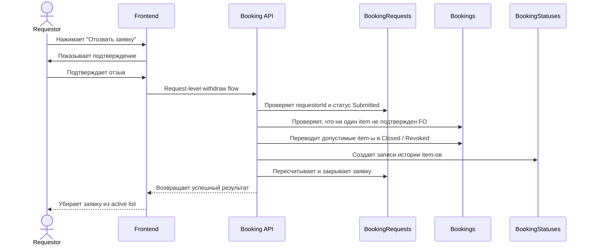

# UC-REQ-05 - Отзыв submitted-заявки requestor-ом

**Created:** 2026-05-20  
**Last updated:** 2026-06-02  
**Автор документов:** Telman Nurzhanov (SA)

---

## Карточка use case

| Поле | Значение |
|---|---|
| Область действия | Страница `Мои заявки` / карточка submitted-заявки |
| Участник | Пользователь с ролью `Requestor` или `ServiceWorkProcessor` |
| Покрываемые FR (BRD) | `FR-025`, `FR-058`, `FR-NEW-17` |
| Покрываемые FR (Additional list) | `BRD-U-003` |
| Предусловие | Пользователь авторизован; у пользователя есть собственная заявка в статусе `Submitted`; ни один booking item этой заявки еще не был подтвержден Fleet Owner |
| Триггер | Нажатие кнопки `Отозвать заявку` |
| Ожидаемый результат | Все еще не обработанные booking item-ы заявки отозваны, заявка больше не активна и переходит в `Closed` |
| Используемые API | [`GET /booking-requests/my`](../../../api/booking/requestor/GET_booking_requests_my.md), [`GET /booking-requests/{id}`](../../../api/booking/requestor/GET_booking_requests_id.md), request-level withdraw API / orchestration over [`POST /bookings/{id}/revoke`](../../../api/booking/requestor/POST_bookings_id_revoke.md) *(TBD)* |

---

## Основной сценарий

1. Пользователь открывает страницу `Мои заявки`.
2. Frontend загружает список заявок через [`GET /booking-requests/my`](../../../api/booking/requestor/GET_booking_requests_my.md).
3. Для submitted-заявки frontend показывает действие `Отозвать заявку`, только если ни один booking item этой заявки еще не был подтвержден Fleet Owner.
4. Пользователь нажимает `Отозвать заявку`.
5. Frontend показывает подтверждающий диалог и предупреждает, что будут отозваны все еще не обработанные booking item-ы заявки.
6. После подтверждения frontend вызывает request-level withdraw flow.
7. Backend проверяет, что:
   - `BookingRequests.requestorId` совпадает с текущим пользователем;
   - request status равен `Submitted`;
   - в заявке нет booking item-ов, уже дошедших до FO confirmation или более позднего этапа lifecycle.
8. Backend отзывает все допустимые booking item-ы заявки.
9. Для каждого такого item backend переводит `Bookings.status` в `Closed` с terminal причиной `Revoked` и пишет запись в `BookingStatuses`.
10. Backend пересчитывает агрегированный статус заявки.
11. После того как активных item-ов в заявке не остается, request status переходит в `Closed`.
12. Frontend обновляет экран и убирает заявку из списка активных заявок.

---

## UML Sequence Diagram

---

## Альтернативные сценарии

1. Пользователь передумал отзывать заявку.
   Пользователь закрывает подтверждающий диалог, запрос не выполняется.

2. Хотя бы один booking item уже подтвержден Fleet Owner.
   Система не разрешает request-level withdraw. Пользователь может работать только с отдельными допустимыми booking item-ами по item-level сценариям.

3. Пока пользователь подтверждал действие, один из booking item-ов был обработан FO.
   Backend отклоняет request-level withdraw и возвращает бизнес-ошибку о недопустимости массового отзыва.

4. В заявке несколько booking item-ов по разным fleet owner.
   Request-level withdraw разрешен только пока ни один item не дошел до первого FO confirmation; после этого сценарий недоступен полностью.

---

## Замечания

1. Это отдельный сценарий по сравнению с `UC-REQ-03`, который относится только к отмене draft-заявки до submit.
2. Это отдельный сценарий по сравнению с `UC-REQ-04`, который относится к отзыву одной конкретной брони.
3. На текущем этапе wiki фиксирует бизнес-правило и ожидаемое поведение; конкретный dedicated endpoint может быть выделен отдельно, либо сценарий может быть реализован orchestration-слоем поверх item-level revoke.
