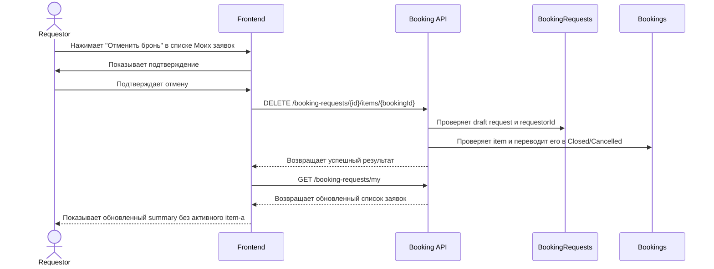

# UC-REQ-07 - Отмена draft-брони requestor-ом со страницы Мои заявки

**Created:** 2026-06-04  
**Last updated:** 2026-06-04  
**Автор документов:** OpenCode

---

## Карточка use case

| Поле | Значение |
|---|---|
| Область действия | Страница `Мои заявки` / summary-блок броней внутри draft-заявки |
| Участник | Пользователь с ролью [`Requestor`](../../Roles%20and%20Access%20Model.md) |
| Покрываемые FR (BRD) | `FR-025`, `FR-027`, `FR-031`, `FR-038` |
| Покрываемые FR (Additional list) | — |
| Предусловие | Пользователь авторизован; у пользователя есть собственная заявка в статусе `Draft`; в заявке есть booking item в статусе `Draft` |
| Триггер | Нажатие кнопки `Отменить бронь` в summary-блоке на странице `Мои заявки` |
| Ожидаемый результат | Выбранный draft booking item переведен в `Closed` с причиной `Cancelled` без перехода внутрь detail view заявки |
| Используемые API | [`GET /booking-requests/my`](../../../api/booking/requestor/GET_booking_requests_my.md), [`DELETE /booking-requests/{id}/items/{bookingId}`](../../../api/booking/requestor/DELETE_booking_requests_id_items_bookingId.md), [`GET /booking-requests/{id}`](../../../api/booking/requestor/GET_booking_requests_id.md) |

---

## Основной сценарий

1. Пользователь открывает страницу `Мои заявки`.
2. Frontend загружает список заявок через [`GET /booking-requests/my`](../../../api/booking/requestor/GET_booking_requests_my.md).
3. Для собственной заявки в статусе `Draft` frontend показывает summary-блок booking item-ов.
4. Для draft booking item frontend показывает действие `Отменить бронь`.
5. Пользователь нажимает `Отменить бронь` для конкретного item-а.
6. Frontend может показать подтверждающий диалог перед выполнением действия.
7. После подтверждения frontend вызывает [`DELETE /booking-requests/{id}/items/{bookingId}`](../../../api/booking/requestor/DELETE_booking_requests_id_items_bookingId.md).
8. Backend проверяет, что:
   - `BookingRequests.requestorId` совпадает с текущим пользователем;
   - заявка находится в статусе `Draft`;
   - booking item принадлежит этой заявке;
   - booking item находится в статусе `Draft`.
9. Backend переводит booking item в terminal state `Closed` с `bookingClosureReason = Cancelled`.
10. Backend сохраняет запись в истории статусов booking item-а.
11. Frontend обновляет список заявок через [`GET /booking-requests/my`](../../../api/booking/requestor/GET_booking_requests_my.md) или локально обновляет summary-блок.
12. Отмененный item больше не отображается в активном составе draft-заявки на странице `Мои заявки`.

---

## UML Sequence Diagram

---

## Альтернативные сценарии

1. Пользователь передумал отменять draft-бронь.
   Пользователь закрывает подтверждающий диалог, вызов API не выполняется.

2. Заявка или booking item уже не в `Draft`.
   Backend возвращает `REQUEST_NOT_EDITABLE`, frontend показывает сообщение об ошибке и не меняет UI.

3. Пользователь пытается отменить booking item не своей заявки.
   Backend возвращает `FORBIDDEN`.

4. Booking item не найден.
   Backend возвращает `NOT_FOUND`, frontend предлагает обновить список заявок.

5. Пользователь отменил последний draft booking item в заявке.
   Заявка остается существовать как пустой draft и может быть позже дополнена новой техникой или полностью отменена request-level сценарием.

---

## Замечания

1. Сценарий нужен для быстрой отмены draft booking item со страницы `Мои заявки` без перехода во внутренний экран редактирования заявки.
2. Бизнес-смысл операции — отмена draft-брони с фиксацией terminal state `Closed` и причины `Cancelled`, а не физическое удаление без истории.
3. Если пользователь хочет отменить всю draft-заявку целиком, используется отдельный сценарий `UC-REQ-03`.
